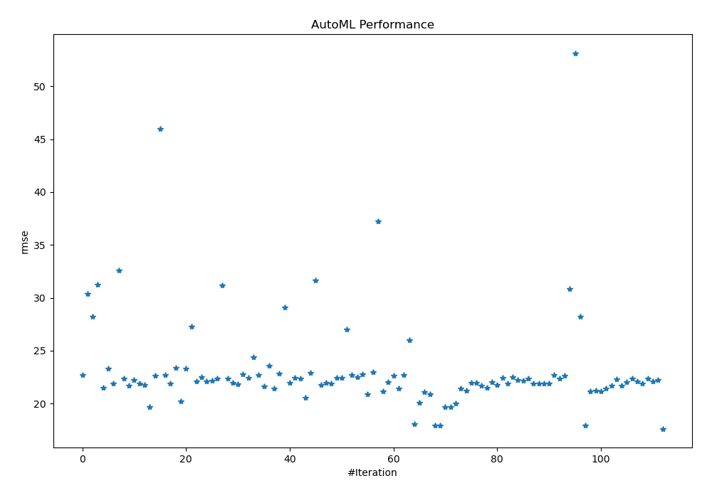
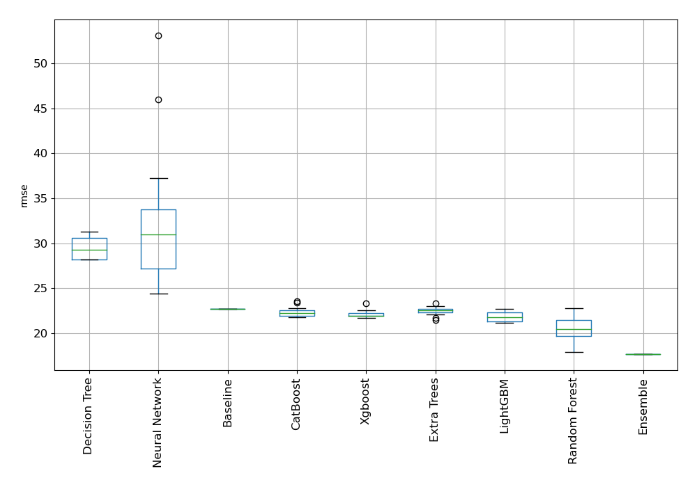
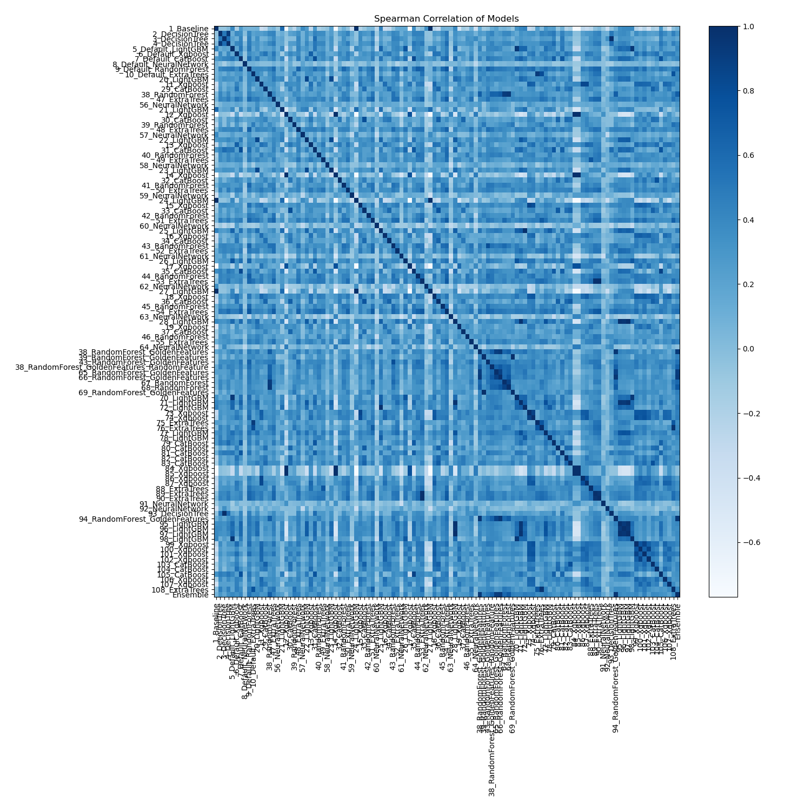

# AutoML Leaderboard

| Best model   | name                                                                                                   | model_type     | metric_type   |   metric_value |   train_time |
|:-------------|:-------------------------------------------------------------------------------------------------------|:---------------|:--------------|---------------:|-------------:|
|              | [1_Baseline](1_Baseline/README.md)                                                                     | Baseline       | rmse          |        22.6949 |         5.98 |
|              | [2_DecisionTree](2_DecisionTree/README.md)                                                             | Decision Tree  | rmse          |        30.3687 |         6.45 |
|              | [3_DecisionTree](3_DecisionTree/README.md)                                                             | Decision Tree  | rmse          |        28.206  |         6.36 |
|              | [4_DecisionTree](4_DecisionTree/README.md)                                                             | Decision Tree  | rmse          |        31.2701 |         6.52 |
|              | [5_Default_LightGBM](5_Default_LightGBM/README.md)                                                     | LightGBM       | rmse          |        21.5004 |        10.07 |
|              | [6_Default_Xgboost](6_Default_Xgboost/README.md)                                                       | Xgboost        | rmse          |        23.3073 |        17.99 |
|              | [7_Default_CatBoost](7_Default_CatBoost/README.md)                                                     | CatBoost       | rmse          |        21.9046 |        38.87 |
|              | [8_Default_NeuralNetwork](8_Default_NeuralNetwork/README.md)                                           | Neural Network | rmse          |        32.6249 |        21.15 |
|              | [9_Default_RandomForest](9_Default_RandomForest/README.md)                                             | Random Forest  | rmse          |        22.382  |        27.08 |
|              | [10_Default_ExtraTrees](10_Default_ExtraTrees/README.md)                                               | Extra Trees    | rmse          |        21.6726 |        24    |
|              | [20_LightGBM](20_LightGBM/README.md)                                                                   | LightGBM       | rmse          |        22.2119 |         8.82 |
|              | [11_Xgboost](11_Xgboost/README.md)                                                                     | Xgboost        | rmse          |        21.9017 |        11.13 |
|              | [29_CatBoost](29_CatBoost/README.md)                                                                   | CatBoost       | rmse          |        21.7635 |        28.72 |
|              | [38_RandomForest](38_RandomForest/README.md)                                                           | Random Forest  | rmse          |        19.7057 |        24.39 |
|              | [47_ExtraTrees](47_ExtraTrees/README.md)                                                               | Extra Trees    | rmse          |        22.671  |        22.5  |
|              | [56_NeuralNetwork](56_NeuralNetwork/README.md)                                                         | Neural Network | rmse          |        45.9766 |        20.08 |
|              | [21_LightGBM](21_LightGBM/README.md)                                                                   | LightGBM       | rmse          |        22.718  |         9.24 |
|              | [12_Xgboost](12_Xgboost/README.md)                                                                     | Xgboost        | rmse          |        21.8915 |         9.34 |
|              | [30_CatBoost](30_CatBoost/README.md)                                                                   | CatBoost       | rmse          |        23.3978 |       114.88 |
|              | [39_RandomForest](39_RandomForest/README.md)                                                           | Random Forest  | rmse          |        20.2501 |        23.8  |
|              | [48_ExtraTrees](48_ExtraTrees/README.md)                                                               | Extra Trees    | rmse          |        23.342  |        22.61 |
|              | [57_NeuralNetwork](57_NeuralNetwork/README.md)                                                         | Neural Network | rmse          |        27.2598 |        21.97 |
|              | [22_LightGBM](22_LightGBM/README.md)                                                                   | LightGBM       | rmse          |        22.1089 |         9.83 |
|              | [13_Xgboost](13_Xgboost/README.md)                                                                     | Xgboost        | rmse          |        22.4994 |        16.93 |
|              | [31_CatBoost](31_CatBoost/README.md)                                                                   | CatBoost       | rmse          |        22.0772 |        30.64 |
|              | [40_RandomForest](40_RandomForest/README.md)                                                           | Random Forest  | rmse          |        22.1425 |        27.52 |
|              | [49_ExtraTrees](49_ExtraTrees/README.md)                                                               | Extra Trees    | rmse          |        22.3923 |        28.85 |
|              | [58_NeuralNetwork](58_NeuralNetwork/README.md)                                                         | Neural Network | rmse          |        31.1582 |        24.62 |
|              | [23_LightGBM](23_LightGBM/README.md)                                                                   | LightGBM       | rmse          |        22.3856 |        10.09 |
|              | [14_Xgboost](14_Xgboost/README.md)                                                                     | Xgboost        | rmse          |        21.942  |        10    |
|              | [32_CatBoost](32_CatBoost/README.md)                                                                   | CatBoost       | rmse          |        21.7999 |        33.34 |
|              | [41_RandomForest](41_RandomForest/README.md)                                                           | Random Forest  | rmse          |        22.7418 |        36.94 |
|              | [50_ExtraTrees](50_ExtraTrees/README.md)                                                               | Extra Trees    | rmse          |        22.4496 |        23.07 |
|              | [59_NeuralNetwork](59_NeuralNetwork/README.md)                                                         | Neural Network | rmse          |        24.3992 |        23.09 |
|              | [24_LightGBM](24_LightGBM/README.md)                                                                   | LightGBM       | rmse          |        22.6949 |         9.36 |
|              | [15_Xgboost](15_Xgboost/README.md)                                                                     | Xgboost        | rmse          |        21.6596 |        15.54 |
|              | [33_CatBoost](33_CatBoost/README.md)                                                                   | CatBoost       | rmse          |        23.5619 |       113.21 |
|              | [42_RandomForest](42_RandomForest/README.md)                                                           | Random Forest  | rmse          |        21.4578 |        27.42 |
|              | [51_ExtraTrees](51_ExtraTrees/README.md)                                                               | Extra Trees    | rmse          |        22.8531 |        31.21 |
|              | [60_NeuralNetwork](60_NeuralNetwork/README.md)                                                         | Neural Network | rmse          |        29.0706 |        23.07 |
|              | [25_LightGBM](25_LightGBM/README.md)                                                                   | LightGBM       | rmse          |        21.9842 |        11.64 |
|              | [16_Xgboost](16_Xgboost/README.md)                                                                     | Xgboost        | rmse          |        22.433  |        14.35 |
|              | [34_CatBoost](34_CatBoost/README.md)                                                                   | CatBoost       | rmse          |        22.361  |        33.72 |
|              | [43_RandomForest](43_RandomForest/README.md)                                                           | Random Forest  | rmse          |        20.5757 |        30.83 |
|              | [52_ExtraTrees](52_ExtraTrees/README.md)                                                               | Extra Trees    | rmse          |        22.9012 |        26.01 |
|              | [61_NeuralNetwork](61_NeuralNetwork/README.md)                                                         | Neural Network | rmse          |        31.6854 |        26.03 |
|              | [26_LightGBM](26_LightGBM/README.md)                                                                   | LightGBM       | rmse          |        21.755  |        12.08 |
|              | [17_Xgboost](17_Xgboost/README.md)                                                                     | Xgboost        | rmse          |        21.9558 |        11.56 |
|              | [35_CatBoost](35_CatBoost/README.md)                                                                   | CatBoost       | rmse          |        21.8777 |        31.21 |
|              | [44_RandomForest](44_RandomForest/README.md)                                                           | Random Forest  | rmse          |        22.4656 |        32.27 |
|              | [53_ExtraTrees](53_ExtraTrees/README.md)                                                               | Extra Trees    | rmse          |        22.441  |        25.73 |
|              | [62_NeuralNetwork](62_NeuralNetwork/README.md)                                                         | Neural Network | rmse          |        27.0275 |        23.2  |
|              | [27_LightGBM](27_LightGBM/README.md)                                                                   | LightGBM       | rmse          |        22.6949 |        10.69 |
|              | [18_Xgboost](18_Xgboost/README.md)                                                                     | Xgboost        | rmse          |        22.5068 |        22.34 |
|              | [36_CatBoost](36_CatBoost/README.md)                                                                   | CatBoost       | rmse          |        22.7816 |        57.14 |
|              | [45_RandomForest](45_RandomForest/README.md)                                                           | Random Forest  | rmse          |        20.9053 |        26.44 |
|              | [54_ExtraTrees](54_ExtraTrees/README.md)                                                               | Extra Trees    | rmse          |        22.9946 |        29.66 |
|              | [63_NeuralNetwork](63_NeuralNetwork/README.md)                                                         | Neural Network | rmse          |        37.2334 |        22.62 |
|              | [28_LightGBM](28_LightGBM/README.md)                                                                   | LightGBM       | rmse          |        21.1396 |        16.08 |
|              | [19_Xgboost](19_Xgboost/README.md)                                                                     | Xgboost        | rmse          |        22.0149 |        25.26 |
|              | [37_CatBoost](37_CatBoost/README.md)                                                                   | CatBoost       | rmse          |        22.6681 |        54.1  |
|              | [46_RandomForest](46_RandomForest/README.md)                                                           | Random Forest  | rmse          |        21.456  |        25.47 |
|              | [55_ExtraTrees](55_ExtraTrees/README.md)                                                               | Extra Trees    | rmse          |        22.6761 |        25.33 |
|              | [64_NeuralNetwork](64_NeuralNetwork/README.md)                                                         | Neural Network | rmse          |        26.0145 |        24.42 |
|              | [38_RandomForest_GoldenFeatures](38_RandomForest_GoldenFeatures/README.md)                             | Random Forest  | rmse          |        18.0506 |       150.39 |
|              | [39_RandomForest_GoldenFeatures](39_RandomForest_GoldenFeatures/README.md)                             | Random Forest  | rmse          |        20.0567 |        31.44 |
|              | [43_RandomForest_GoldenFeatures](43_RandomForest_GoldenFeatures/README.md)                             | Random Forest  | rmse          |        21.087  |        30.68 |
|              | [38_RandomForest_GoldenFeatures_RandomFeature](38_RandomForest_GoldenFeatures_RandomFeature/README.md) | Random Forest  | rmse          |        20.862  |       262.84 |
|              | [65_RandomForest_GoldenFeatures](65_RandomForest_GoldenFeatures/README.md)                             | Random Forest  | rmse          |        17.9301 |        30.32 |
|              | [66_RandomForest_GoldenFeatures](66_RandomForest_GoldenFeatures/README.md)                             | Random Forest  | rmse          |        17.9438 |        31.23 |
|              | [67_RandomForest](67_RandomForest/README.md)                                                           | Random Forest  | rmse          |        19.6607 |        28.47 |
|              | [68_RandomForest](68_RandomForest/README.md)                                                           | Random Forest  | rmse          |        19.6933 |        29.2  |
|              | [69_RandomForest_GoldenFeatures](69_RandomForest_GoldenFeatures/README.md)                             | Random Forest  | rmse          |        20.0304 |        32.26 |
|              | [70_LightGBM](70_LightGBM/README.md)                                                                   | LightGBM       | rmse          |        21.3973 |        14.66 |
|              | [71_LightGBM](71_LightGBM/README.md)                                                                   | LightGBM       | rmse          |        21.2221 |        16.85 |
|              | [72_LightGBM](72_LightGBM/README.md)                                                                   | LightGBM       | rmse          |        21.9667 |        14.58 |
|              | [73_Xgboost](73_Xgboost/README.md)                                                                     | Xgboost        | rmse          |        21.9974 |        17.67 |
|              | [74_Xgboost](74_Xgboost/README.md)                                                                     | Xgboost        | rmse          |        21.6742 |        18.07 |
|              | [75_ExtraTrees](75_ExtraTrees/README.md)                                                               | Extra Trees    | rmse          |        21.4828 |        30.93 |
|              | [76_ExtraTrees](76_ExtraTrees/README.md)                                                               | Extra Trees    | rmse          |        22.0384 |        29.25 |
|              | [77_LightGBM](77_LightGBM/README.md)                                                                   | LightGBM       | rmse          |        21.7376 |        24.07 |
|              | [78_LightGBM](78_LightGBM/README.md)                                                                   | LightGBM       | rmse          |        22.4339 |        14.15 |
|              | [79_CatBoost](79_CatBoost/README.md)                                                                   | CatBoost       | rmse          |        21.9126 |        32.83 |
|              | [80_CatBoost](80_CatBoost/README.md)                                                                   | CatBoost       | rmse          |        22.5364 |        37.37 |
|              | [81_CatBoost](81_CatBoost/README.md)                                                                   | CatBoost       | rmse          |        22.2416 |        37.62 |
|              | [82_CatBoost](82_CatBoost/README.md)                                                                   | CatBoost       | rmse          |        22.156  |        38.66 |
|              | [83_CatBoost](83_CatBoost/README.md)                                                                   | CatBoost       | rmse          |        22.3558 |        35.06 |
|              | [84_Xgboost](84_Xgboost/README.md)                                                                     | Xgboost        | rmse          |        21.8915 |        14.21 |
|              | [85_Xgboost](85_Xgboost/README.md)                                                                     | Xgboost        | rmse          |        21.8915 |        14.71 |
|              | [86_Xgboost](86_Xgboost/README.md)                                                                     | Xgboost        | rmse          |        21.8824 |        17.06 |
|              | [87_Xgboost](87_Xgboost/README.md)                                                                     | Xgboost        | rmse          |        21.8842 |        16.55 |
|              | [88_ExtraTrees](88_ExtraTrees/README.md)                                                               | Extra Trees    | rmse          |        22.6816 |        29.9  |
|              | [89_ExtraTrees](89_ExtraTrees/README.md)                                                               | Extra Trees    | rmse          |        22.3519 |        29.13 |
|              | [90_ExtraTrees](90_ExtraTrees/README.md)                                                               | Extra Trees    | rmse          |        22.6095 |        28.92 |
|              | [91_NeuralNetwork](91_NeuralNetwork/README.md)                                                         | Neural Network | rmse          |        30.8623 |        27.74 |
|              | [92_NeuralNetwork](92_NeuralNetwork/README.md)                                                         | Neural Network | rmse          |        53.1406 |        25.97 |
|              | [93_DecisionTree](93_DecisionTree/README.md)                                                           | Decision Tree  | rmse          |        28.206  |        12.45 |
|              | [94_RandomForest_GoldenFeatures](94_RandomForest_GoldenFeatures/README.md)                             | Random Forest  | rmse          |        17.9505 |        32.61 |
|              | [95_LightGBM](95_LightGBM/README.md)                                                                   | LightGBM       | rmse          |        21.1416 |        18.46 |
|              | [96_LightGBM](96_LightGBM/README.md)                                                                   | LightGBM       | rmse          |        21.2502 |        18.98 |
|              | [97_LightGBM](97_LightGBM/README.md)                                                                   | LightGBM       | rmse          |        21.1396 |        18.7  |
|              | [98_LightGBM](98_LightGBM/README.md)                                                                   | LightGBM       | rmse          |        21.4428 |        16.7  |
|              | [99_Xgboost](99_Xgboost/README.md)                                                                     | Xgboost        | rmse          |        21.6731 |        24.29 |
|              | [100_Xgboost](100_Xgboost/README.md)                                                                   | Xgboost        | rmse          |        22.277  |        17.57 |
|              | [101_Xgboost](101_Xgboost/README.md)                                                                   | Xgboost        | rmse          |        21.7016 |        27.14 |
|              | [102_Xgboost](102_Xgboost/README.md)                                                                   | Xgboost        | rmse          |        22.0308 |        33.69 |
|              | [103_CatBoost](103_CatBoost/README.md)                                                                 | CatBoost       | rmse          |        22.3902 |        36.2  |
|              | [104_CatBoost](104_CatBoost/README.md)                                                                 | CatBoost       | rmse          |        22.0855 |        39.4  |
|              | [105_CatBoost](105_CatBoost/README.md)                                                                 | CatBoost       | rmse          |        21.8721 |        32.41 |
|              | [106_Xgboost](106_Xgboost/README.md)                                                                   | Xgboost        | rmse          |        22.3966 |        20.15 |
|              | [107_Xgboost](107_Xgboost/README.md)                                                                   | Xgboost        | rmse          |        22.1182 |        17.48 |
|              | [108_ExtraTrees](108_ExtraTrees/README.md)                                                             | Extra Trees    | rmse          |        22.2357 |        29.01 |
| **the best** | [Ensemble](Ensemble/README.md)                                                                         | Ensemble       | rmse          |        17.6264 |        44.76 |

### AutoML Performance

### AutoML Performance Boxplot

### Spearman Correlation of Models

