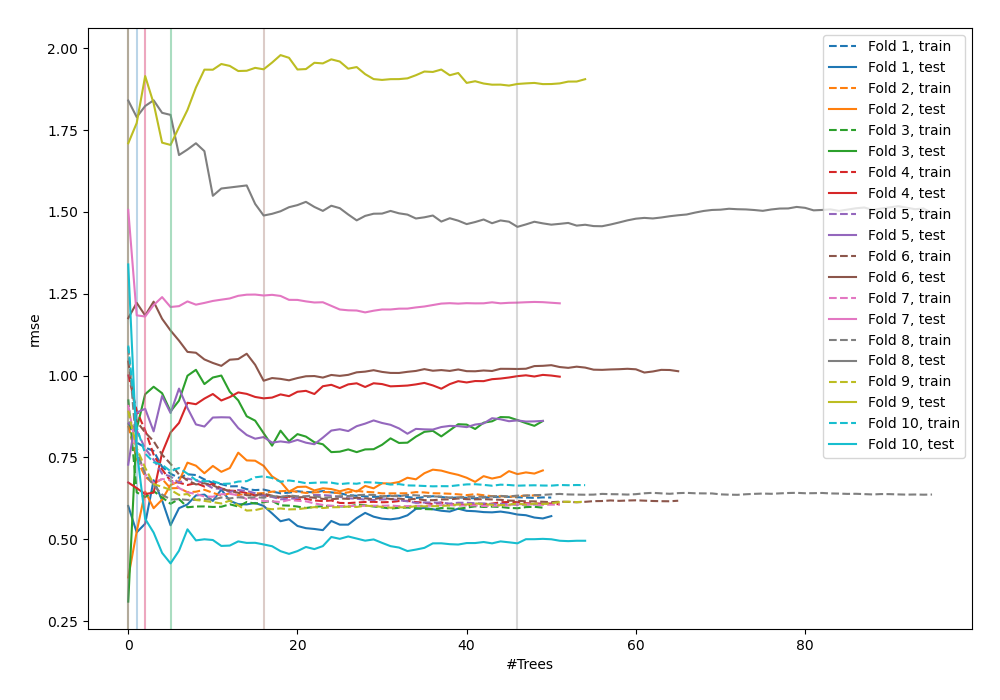
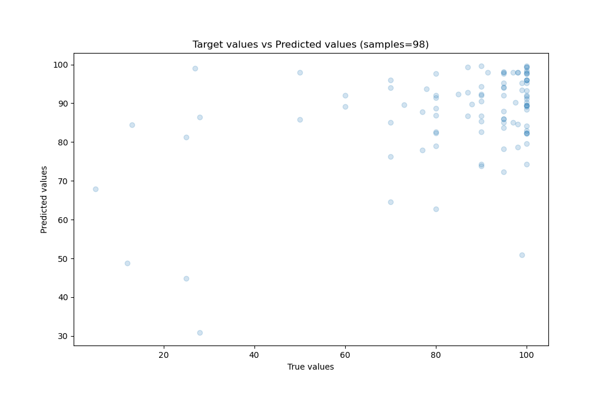
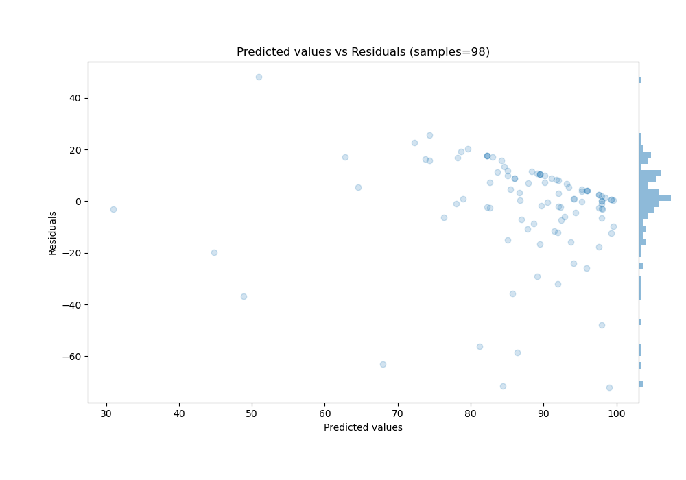

# Summary of 39_RandomForest

[<< Go back](../README.md)

## Random Forest
- **n_jobs**: -1
- **criterion**: mse
- **max_features**: 0.5
- **min_samples_split**: 20
- **max_depth**: 7
- **eval_metric_name**: rmse
- **explain_level**: 0

## Validation
 - **validation_type**: custom

## Optimized metric
rmse

## Training time

23.1 seconds

### Metric details:
| Metric   |      Score |
|:---------|-----------:|
| MAE      |  13.169    |
| MSE      | 410.066    |
| RMSE     |  20.2501   |
| R2       |   0.180775 |
| MAPE     |   0.410804 |

## Learning curves

## True vs Predicted

## Predicted vs Residuals

[<< Go back](../README.md)
