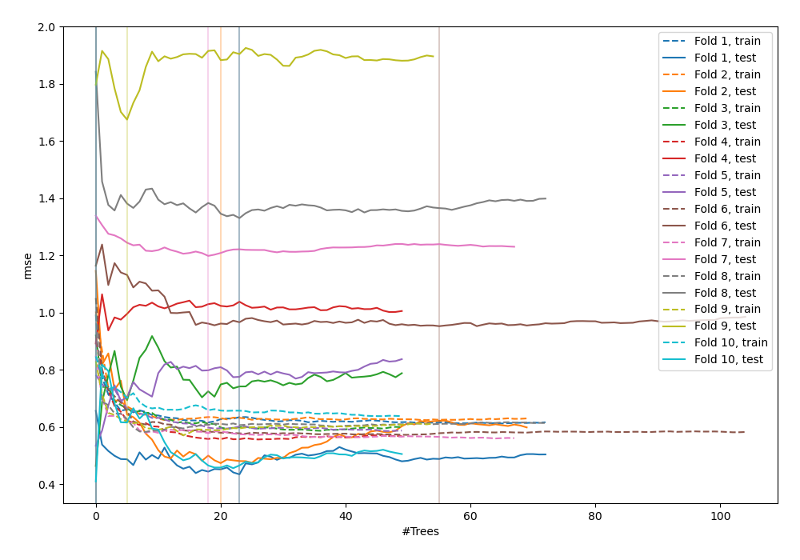
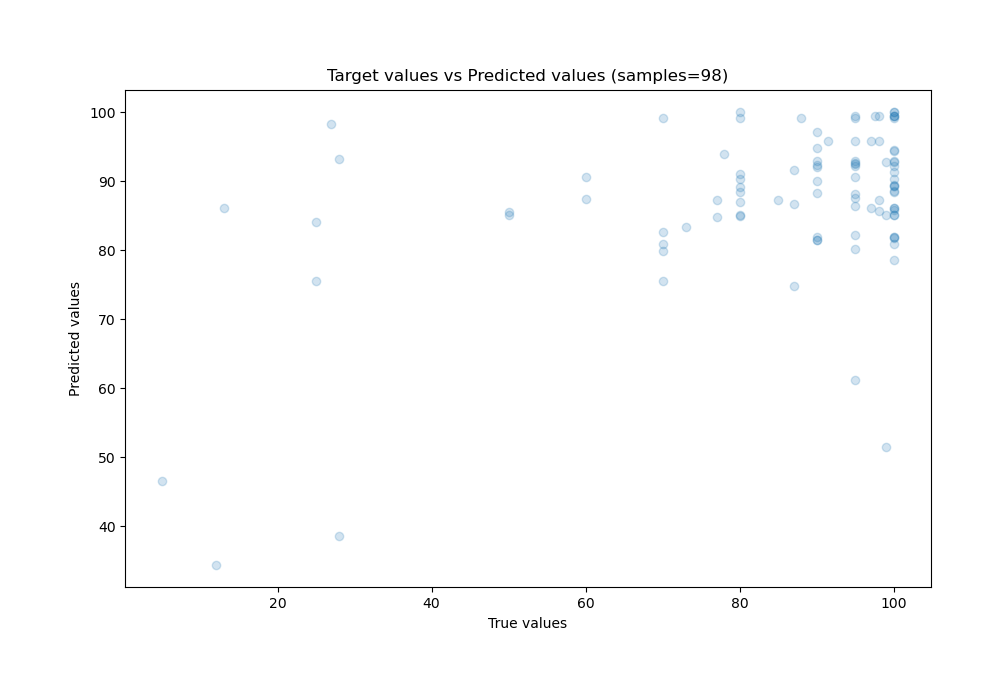
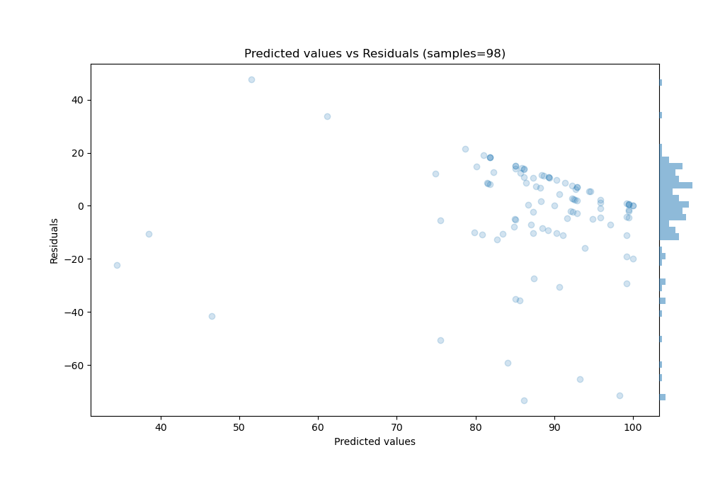

# Summary of 39_RandomForest_GoldenFeatures

[<< Go back](../README.md)

## Random Forest
- **n_jobs**: -1
- **criterion**: mse
- **max_features**: 0.5
- **min_samples_split**: 20
- **max_depth**: 7
- **eval_metric_name**: rmse
- **explain_level**: 0

## Validation
 - **validation_type**: custom

## Optimized metric
rmse

## Training time

30.7 seconds

### Metric details:
| Metric   |      Score |
|:---------|-----------:|
| MAE      |  13.2934   |
| MSE      | 402.273    |
| RMSE     |  20.0567   |
| R2       |   0.196345 |
| MAPE     |   0.372964 |

## Learning curves

## True vs Predicted

## Predicted vs Residuals

[<< Go back](../README.md)
