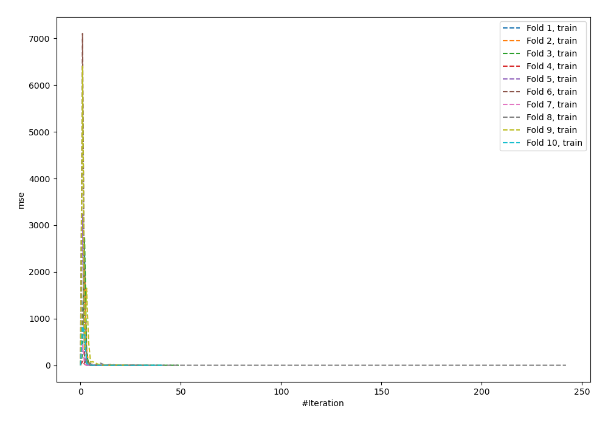
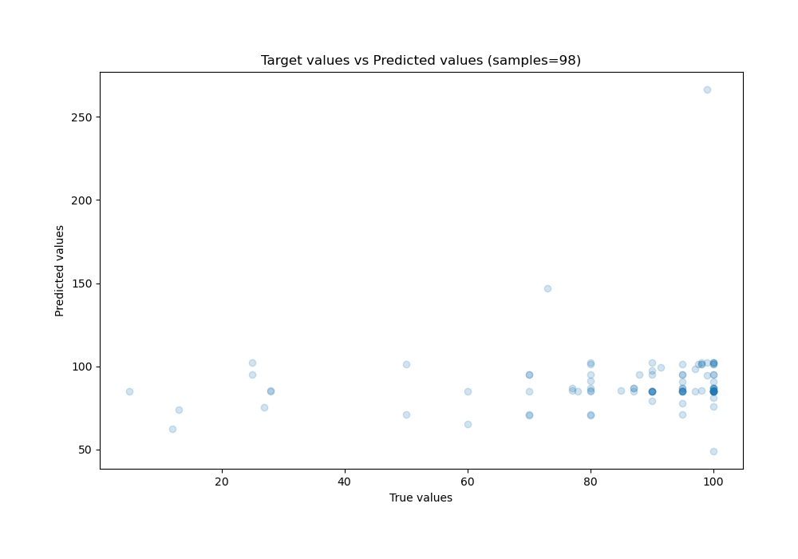
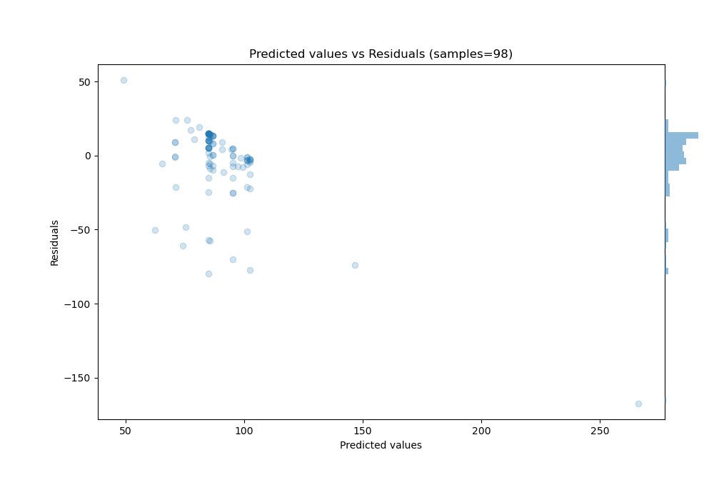

# Summary of 60_NeuralNetwork

[<< Go back](../README.md)

## Neural Network
- **n_jobs**: -1
- **dense_1_size**: 32
- **dense_2_size**: 8
- **learning_rate**: 0.1
- **explain_level**: 0

## Validation
 - **validation_type**: custom

## Optimized metric
rmse

## Training time

22.5 seconds

### Metric details:
| Metric   |      Score |
|:---------|-----------:|
| MAE      |  17.0651   |
| MSE      | 845.099    |
| RMSE     |  29.0706   |
| R2       |  -0.688328 |
| MAPE     |   0.514016 |

## Learning curves

## True vs Predicted

## Predicted vs Residuals

[<< Go back](../README.md)
