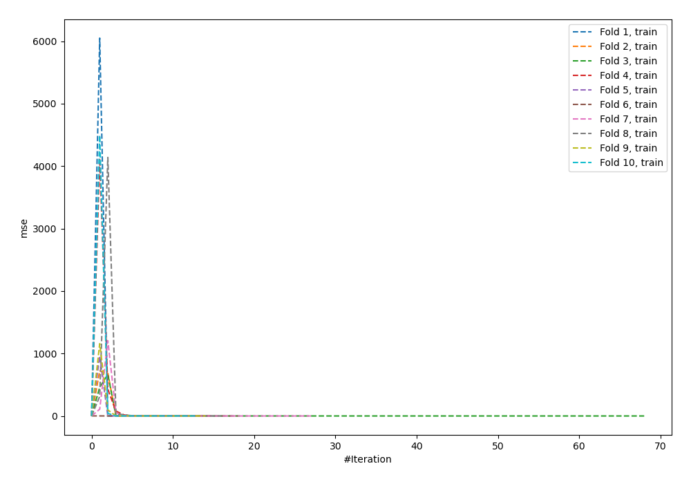
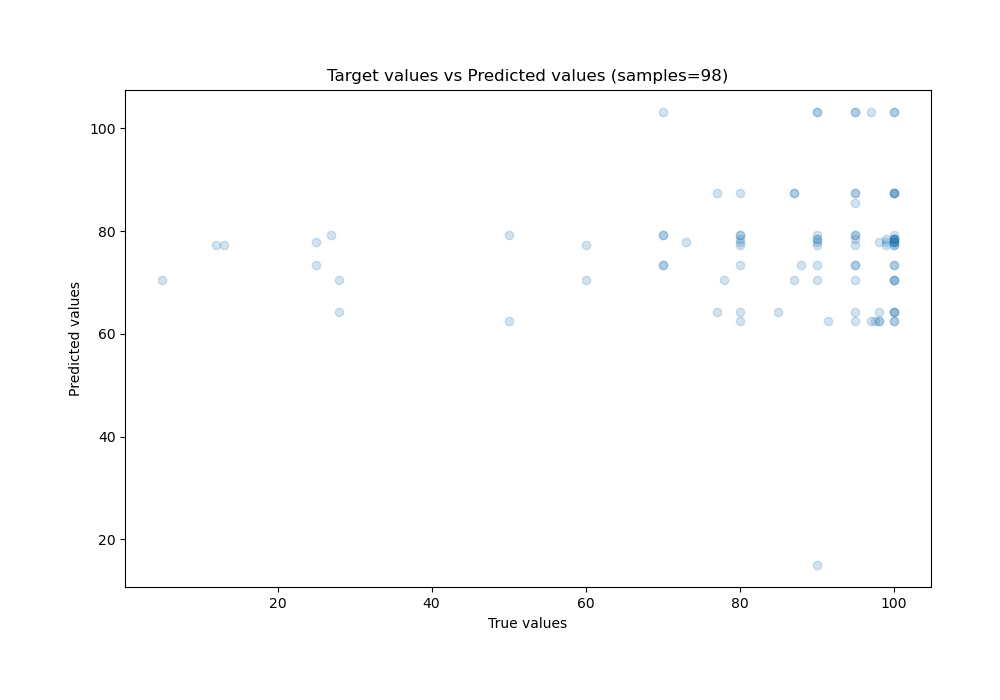
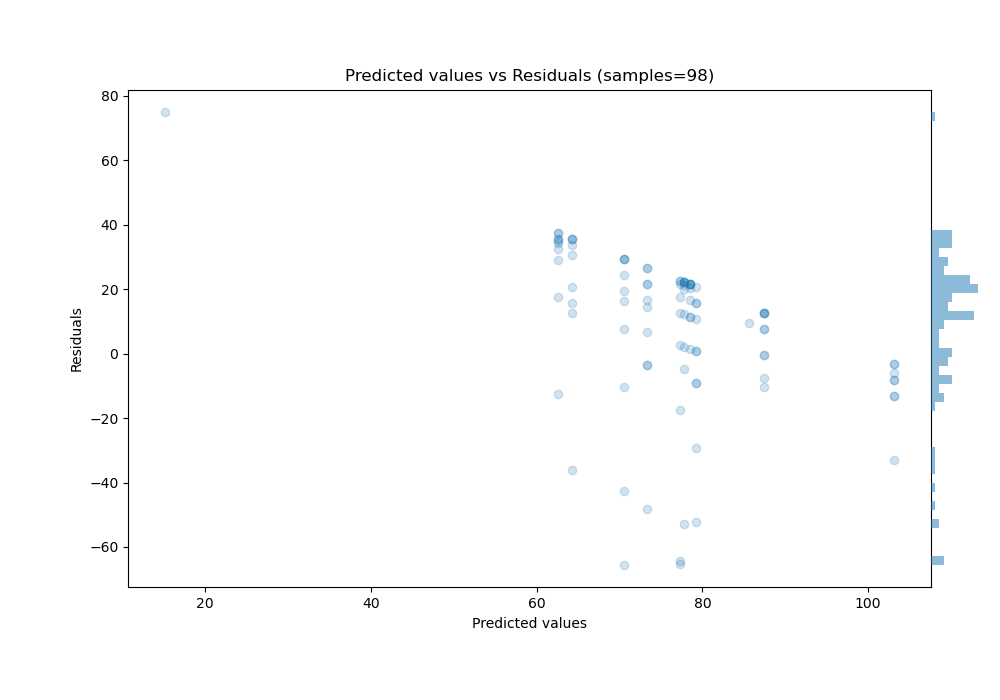

# Summary of 64_NeuralNetwork

[<< Go back](../README.md)

## Neural Network
- **n_jobs**: -1
- **dense_1_size**: 64
- **dense_2_size**: 4
- **learning_rate**: 0.1
- **explain_level**: 0

## Validation
 - **validation_type**: custom

## Optimized metric
rmse

## Training time

23.8 seconds

### Metric details:
| Metric   |      Score |
|:---------|-----------:|
| MAE      |  21.0984   |
| MSE      | 676.753    |
| RMSE     |  26.0145   |
| R2       |  -0.352009 |
| MAPE     |   0.51322  |

## Learning curves

## True vs Predicted

## Predicted vs Residuals

[<< Go back](../README.md)
