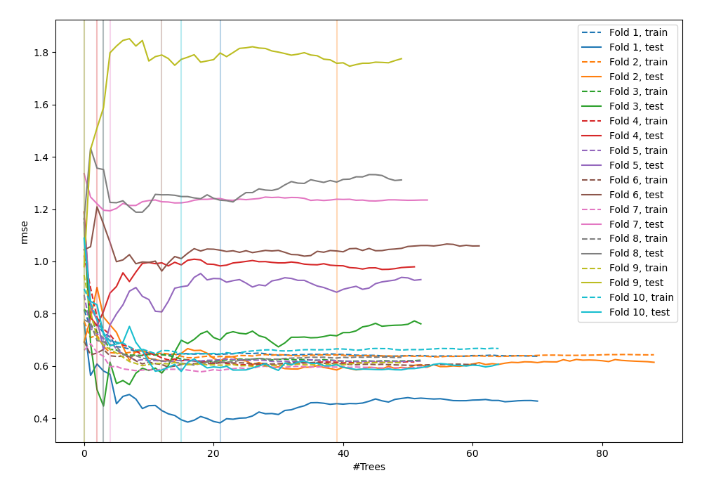
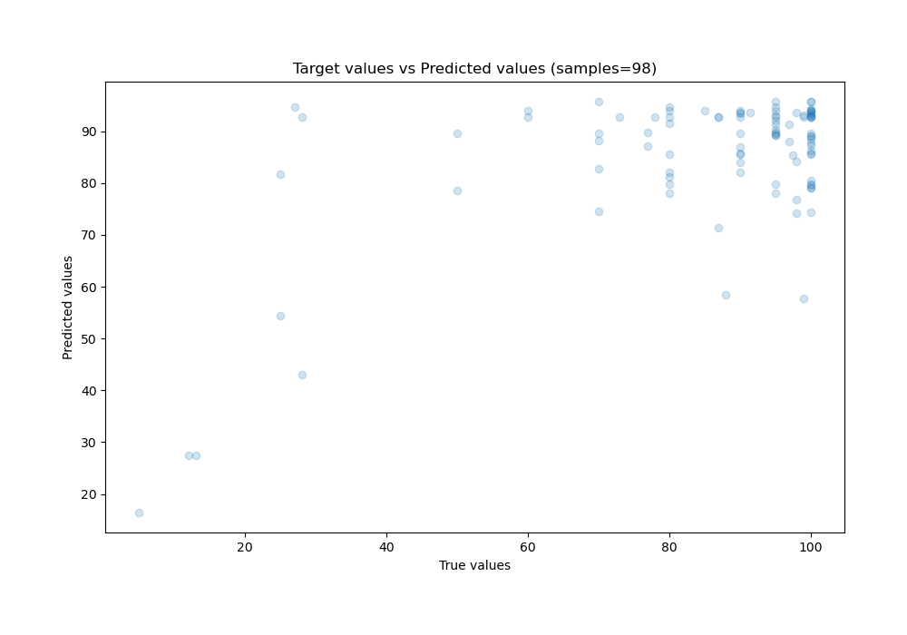
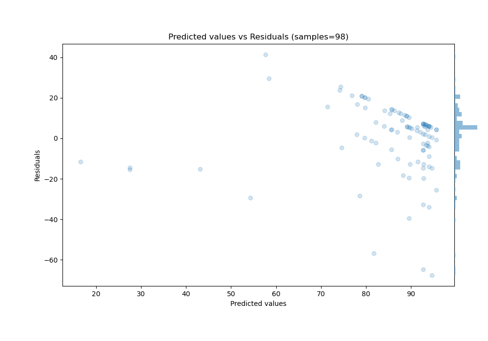

# Summary of 65_RandomForest_GoldenFeatures

[<< Go back](../README.md)

## Random Forest
- **n_jobs**: -1
- **criterion**: mse
- **max_features**: 0.7
- **min_samples_split**: 20
- **max_depth**: 3
- **eval_metric_name**: rmse
- **explain_level**: 0

## Validation
 - **validation_type**: custom

## Optimized metric
rmse

## Training time

29.7 seconds

### Metric details:
| Metric   |      Score |
|:---------|-----------:|
| MAE      |  12.8048   |
| MSE      | 321.489    |
| RMSE     |  17.9301   |
| R2       |   0.357734 |
| MAPE     |   0.25842  |

## Learning curves

## True vs Predicted

## Predicted vs Residuals

[<< Go back](../README.md)
