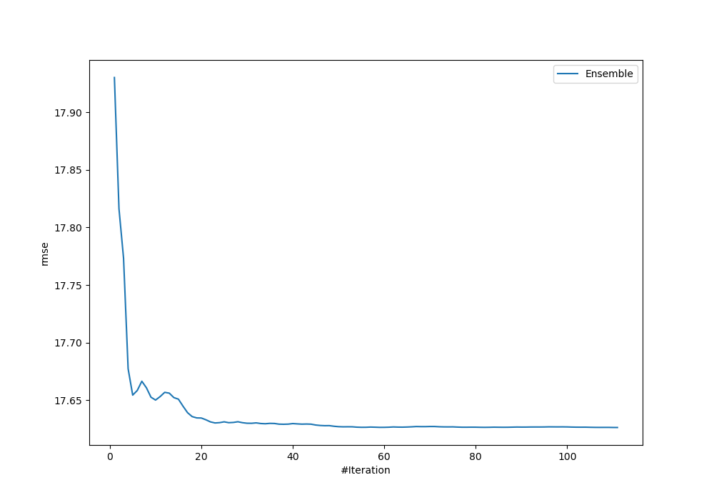
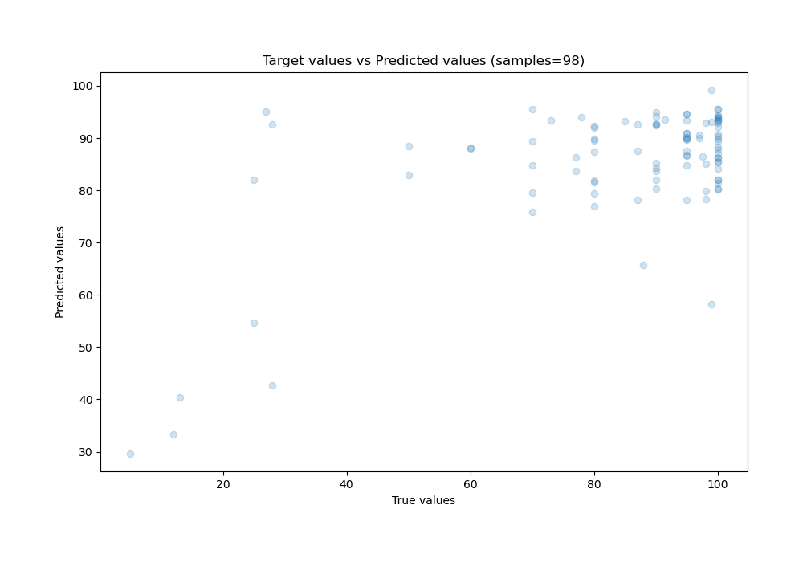
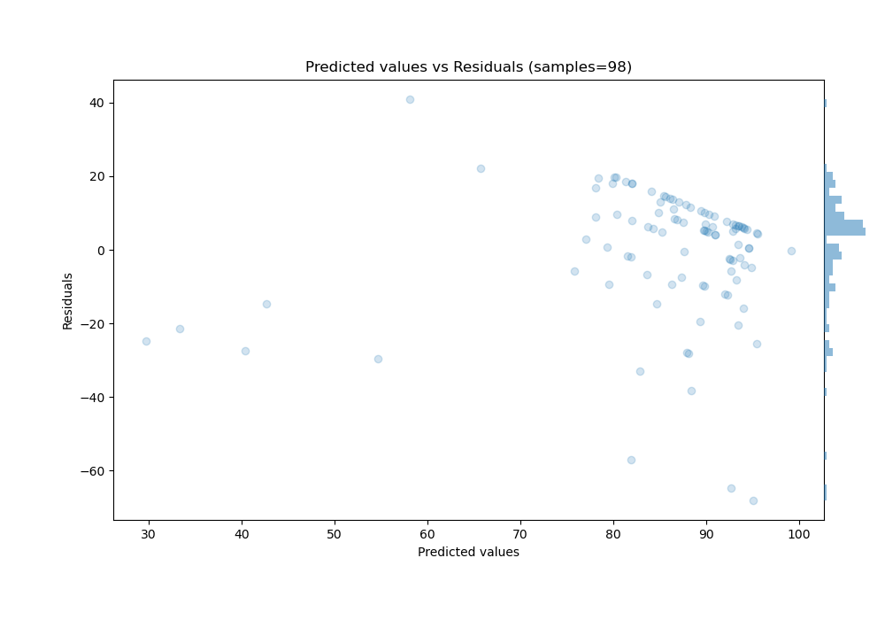

# Summary of Ensemble

[<< Go back](../README.md)

## Ensemble structure
| Model                          |   Weight |
|:-------------------------------|---------:|
| 39_RandomForest                |       19 |
| 39_RandomForest_GoldenFeatures |        1 |
| 60_NeuralNetwork               |        4 |
| 64_NeuralNetwork               |        2 |
| 65_RandomForest_GoldenFeatures |       43 |
| 66_RandomForest_GoldenFeatures |        3 |
| 94_RandomForest_GoldenFeatures |       39 |

### Metric details:
| Metric   |      Score |
|:---------|-----------:|
| MAE      |  12.6371   |
| MSE      | 310.688    |
| RMSE     |  17.6264   |
| R2       |   0.379311 |
| MAPE     |   0.294526 |

## Learning curves

## True vs Predicted

## Predicted vs Residuals

[<< Go back](../README.md)
