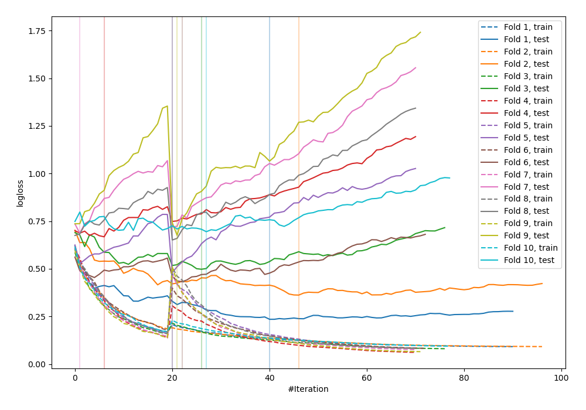
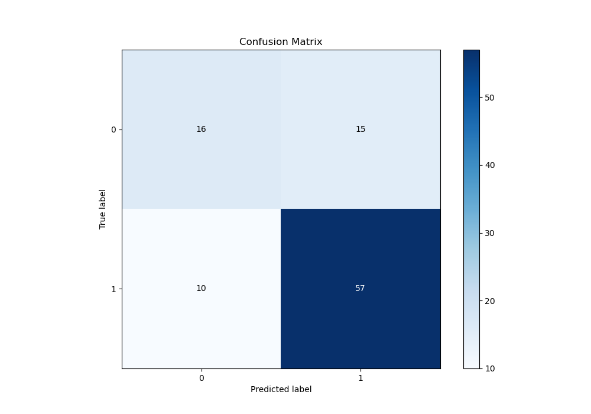
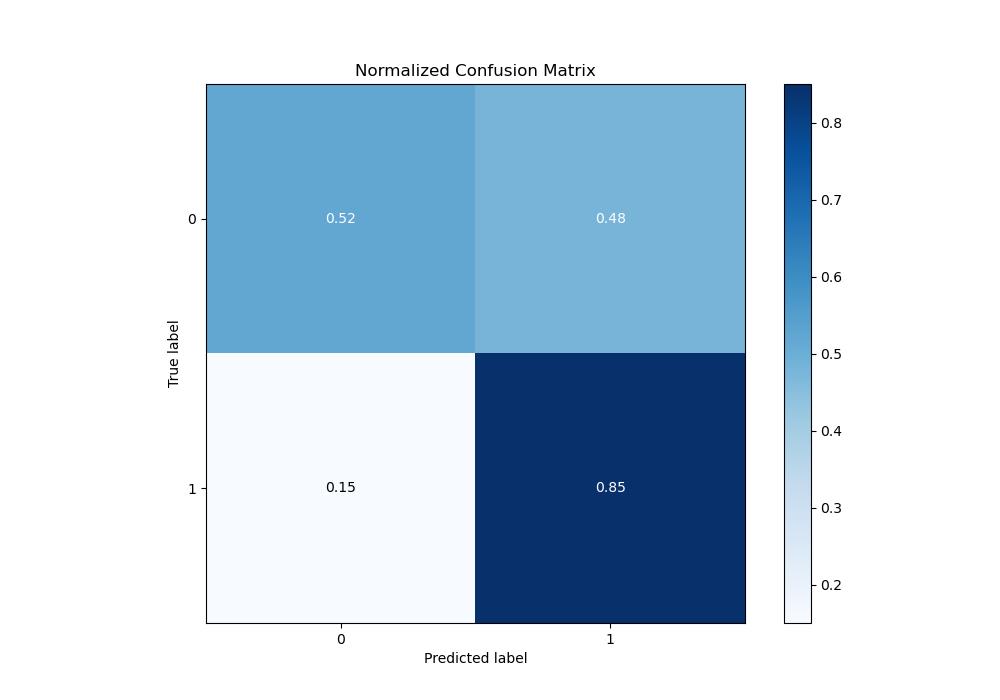
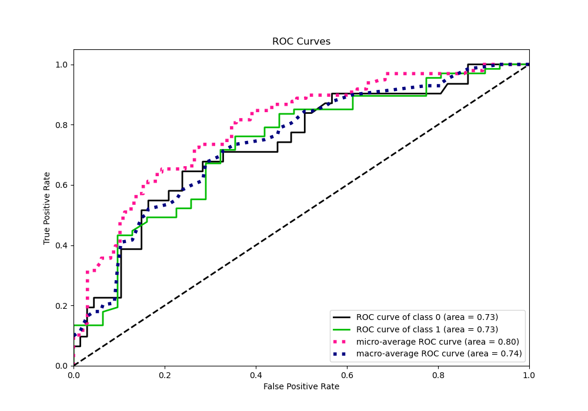
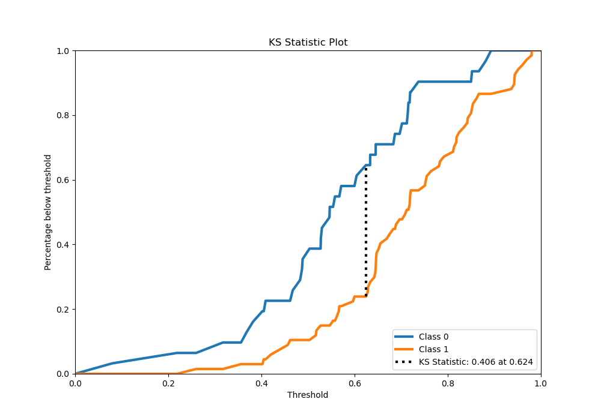
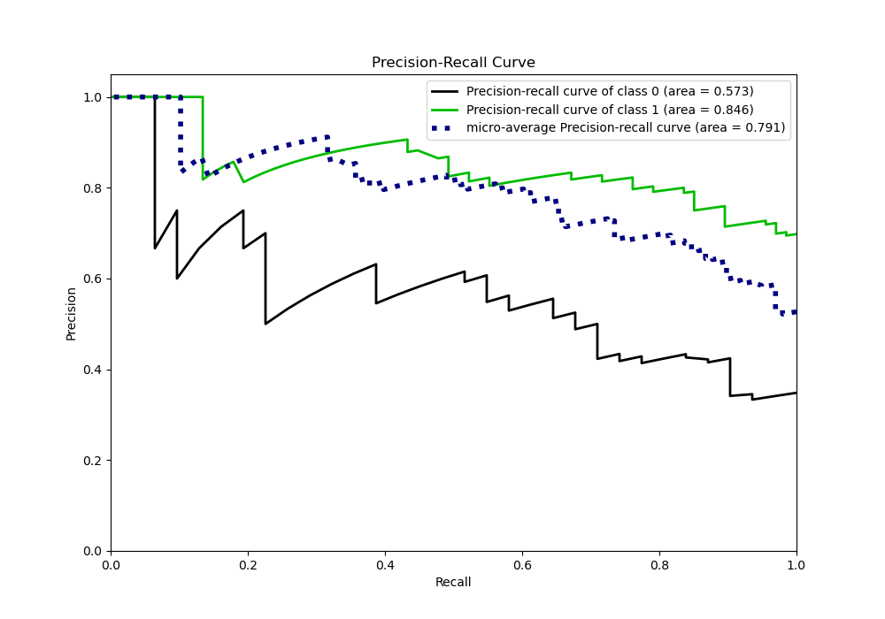
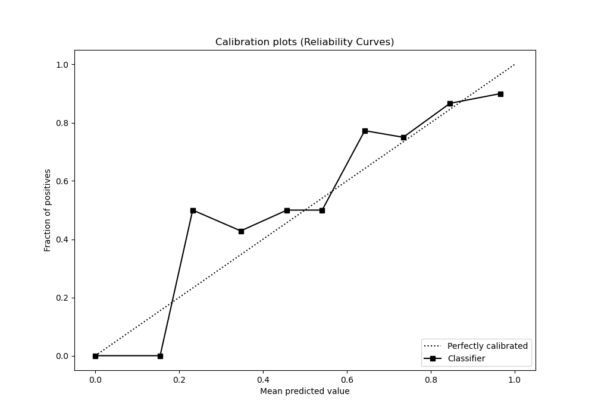
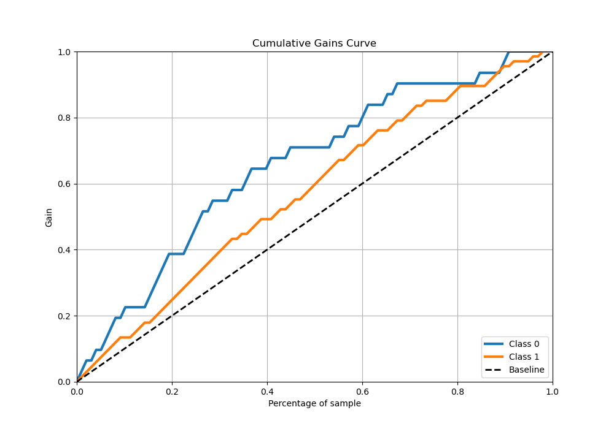
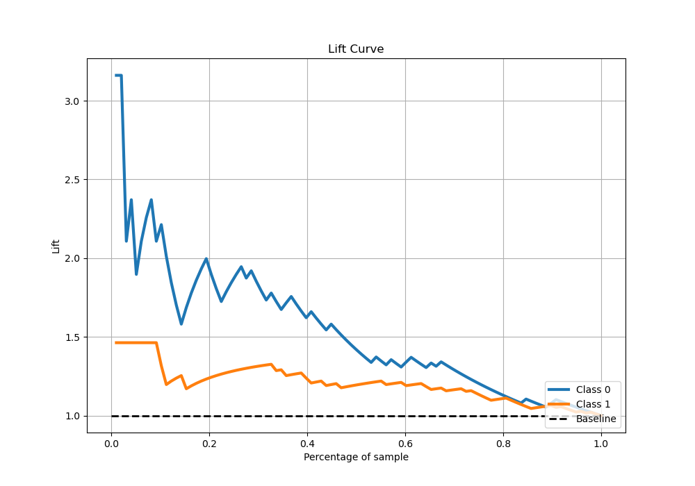

# Summary of 102_CatBoost

[<< Go back](../README.md)

## CatBoost
- **n_jobs**: -1
- **learning_rate**: 0.2
- **depth**: 6
- **rsm**: 1
- **loss_function**: Logloss
- **eval_metric**: Logloss
- **explain_level**: 0

## Validation
 - **validation_type**: custom

## Optimized metric
logloss

## Training time

50.7 seconds

## Metric details
|           |    score |   threshold |
|:----------|---------:|------------:|
| logloss   | 0.546841 | nan         |
| auc       | 0.731584 | nan         |
| f1        | 0.828025 |   0.403565  |
| accuracy  | 0.744898 |   0.549136  |
| precision | 1        |   0.96205   |
| recall    | 1        |   0.0714883 |
| mcc       | 0.395509 |   0.558301  |

## Confusion matrix (at threshold=0.549136)
|              |   Predicted as 0 |   Predicted as 1 |
|:-------------|-----------------:|-----------------:|
| Labeled as 0 |               16 |               15 |
| Labeled as 1 |               10 |               57 |

## Learning curves

## Confusion Matrix

## Normalized Confusion Matrix

## ROC Curve

## Kolmogorov-Smirnov Statistic

## Precision-Recall Curve

## Calibration Curve

## Cumulative Gains Curve

## Lift Curve

[<< Go back](../README.md)
