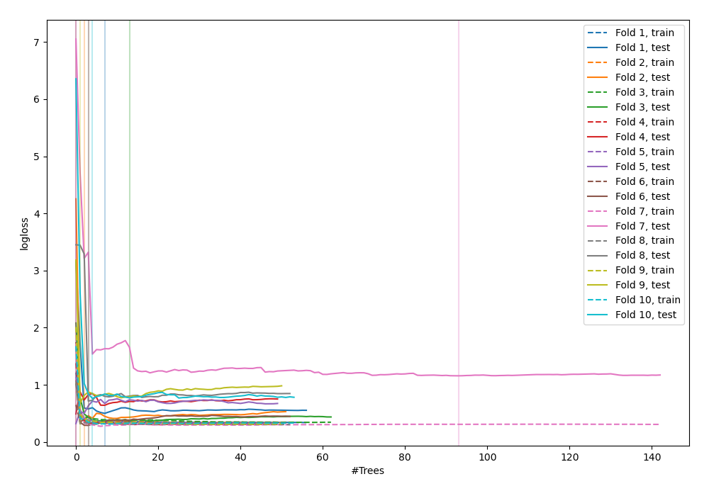
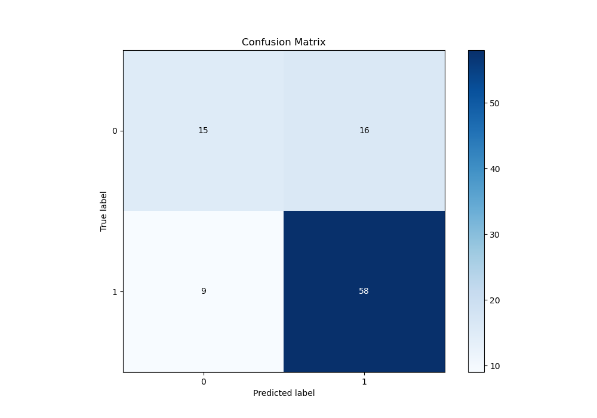
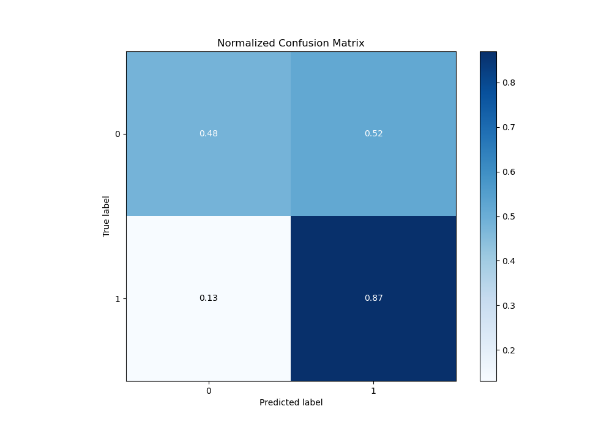
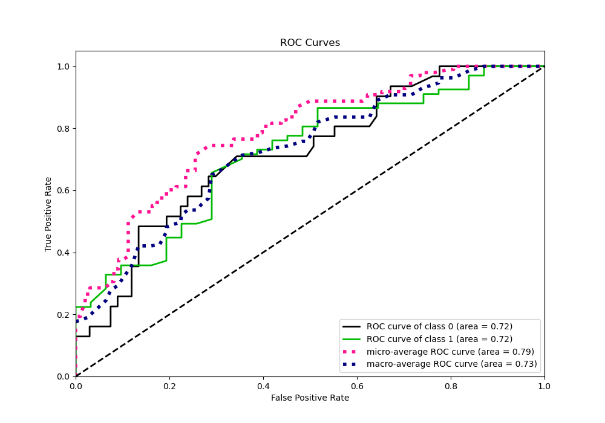
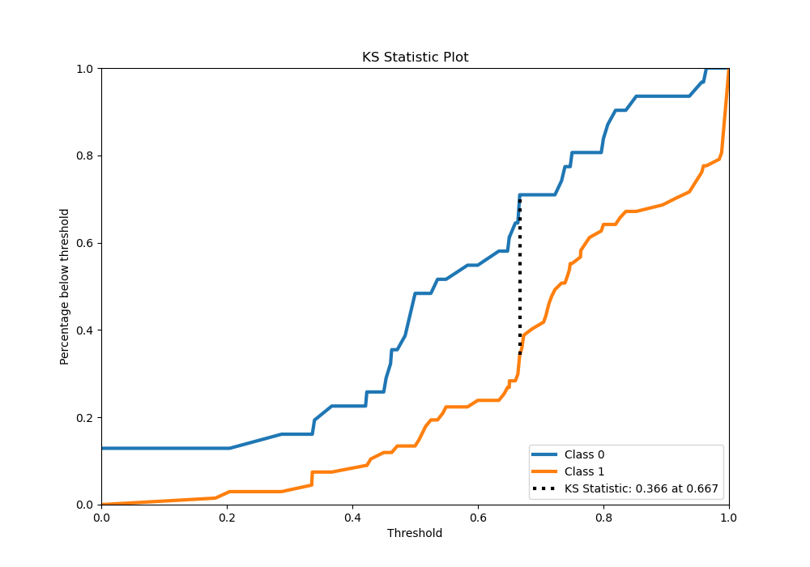
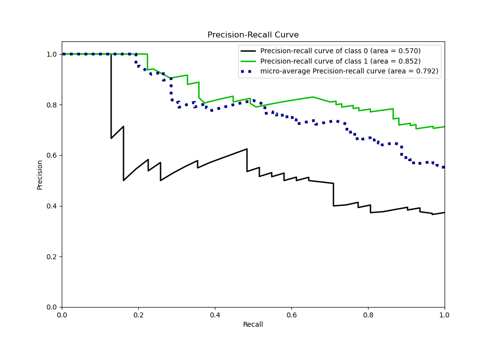
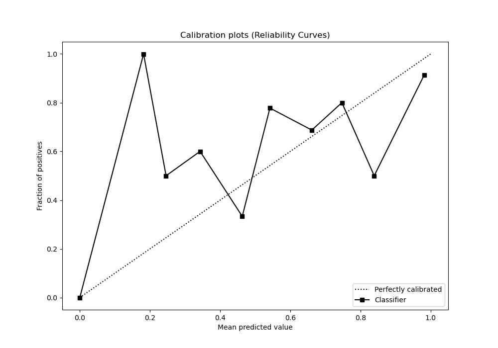
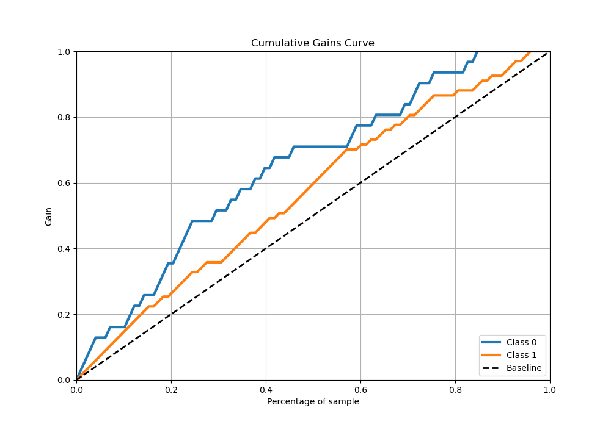
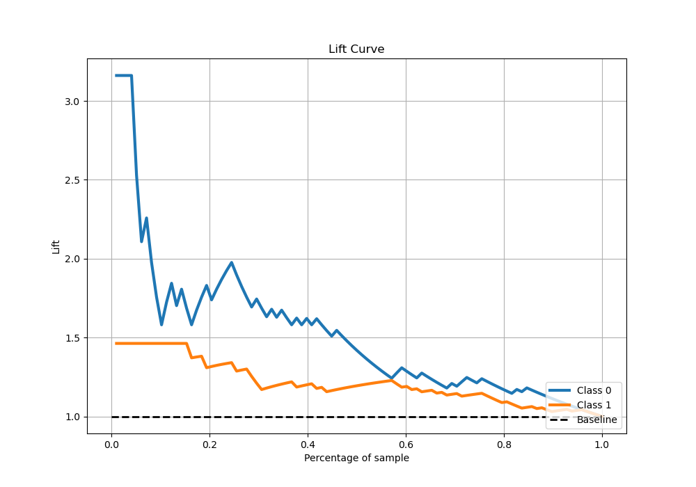

# Summary of 106_RandomForest

[<< Go back](../README.md)

## Random Forest
- **n_jobs**: -1
- **criterion**: entropy
- **max_features**: 0.8
- **min_samples_split**: 20
- **max_depth**: 7
- **eval_metric_name**: logloss
- **explain_level**: 0

## Validation
 - **validation_type**: custom

## Optimized metric
logloss

## Training time

49.2 seconds

## Metric details
|           |    score |   threshold |
|:----------|---------:|------------:|
| logloss   | 0.560881 |  nan        |
| auc       | 0.720029 |  nan        |
| f1        | 0.832298 |    0        |
| accuracy  | 0.744898 |    0.503571 |
| precision | 0.916667 |    0.866667 |
| recall    | 1        |    0        |
| mcc       | 0.378004 |    0.503571 |

## Confusion matrix (at threshold=0.503571)
|              |   Predicted as 0 |   Predicted as 1 |
|:-------------|-----------------:|-----------------:|
| Labeled as 0 |               15 |               16 |
| Labeled as 1 |                9 |               58 |

## Learning curves

## Confusion Matrix

## Normalized Confusion Matrix

## ROC Curve

## Kolmogorov-Smirnov Statistic

## Precision-Recall Curve

## Calibration Curve

## Cumulative Gains Curve

## Lift Curve

[<< Go back](../README.md)
