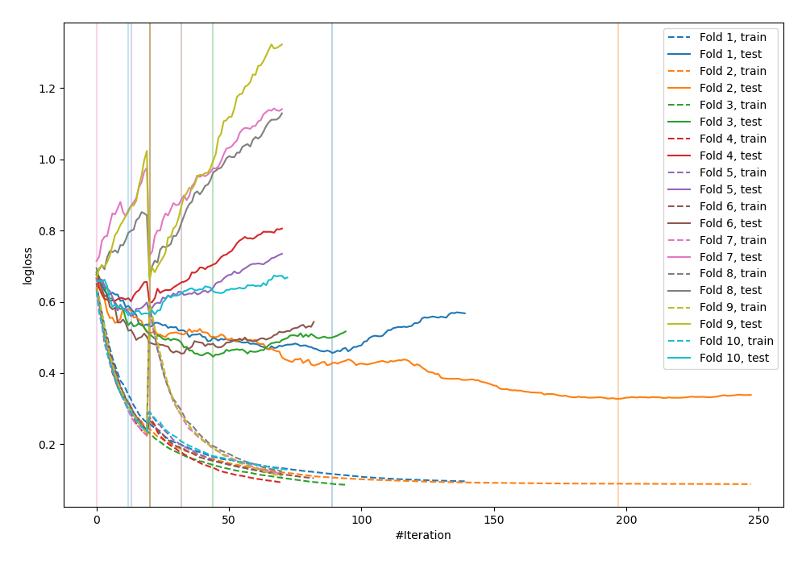
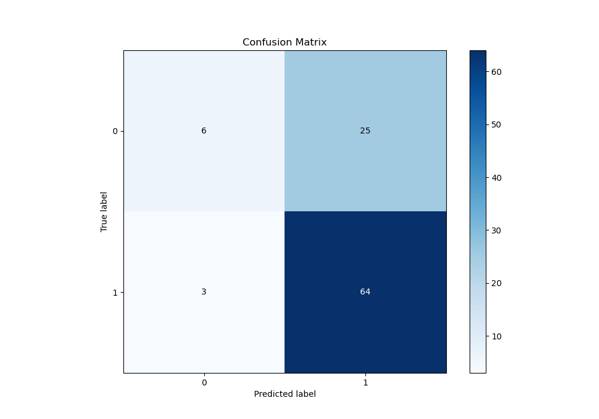
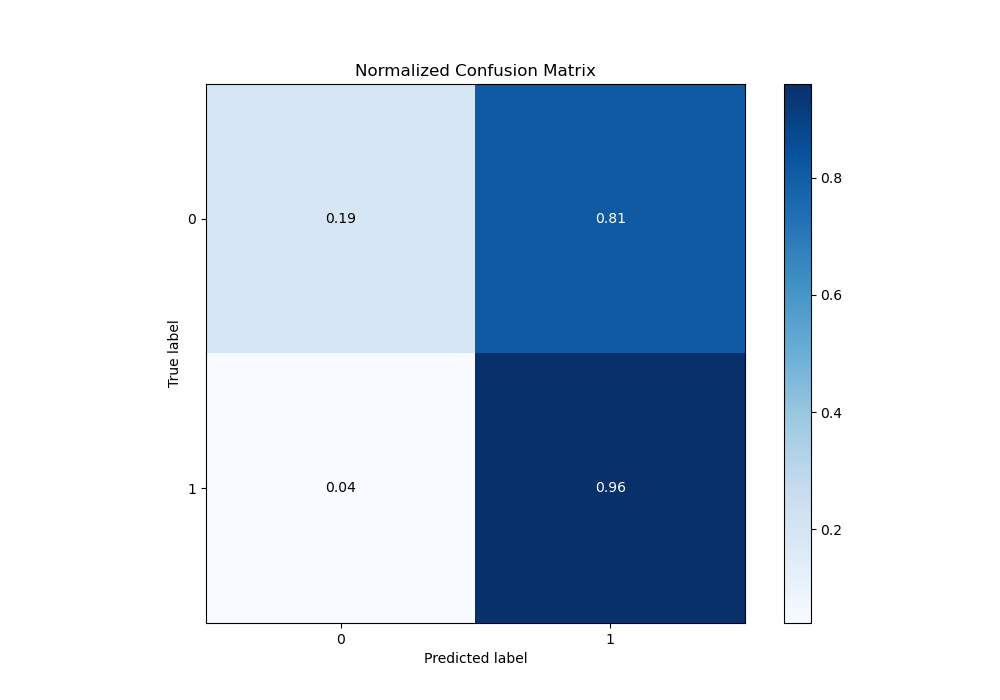
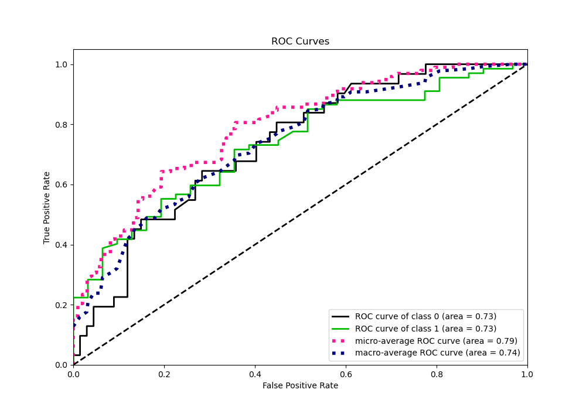
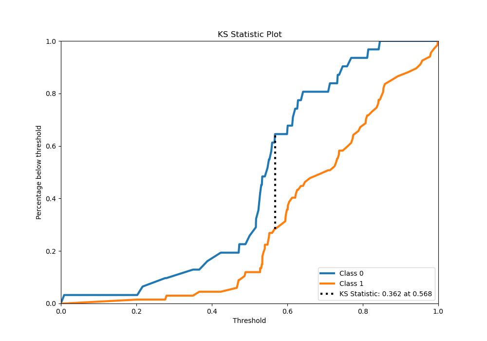
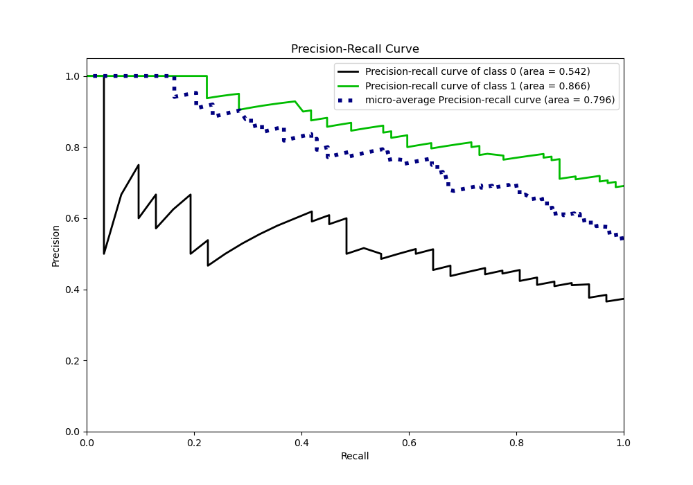
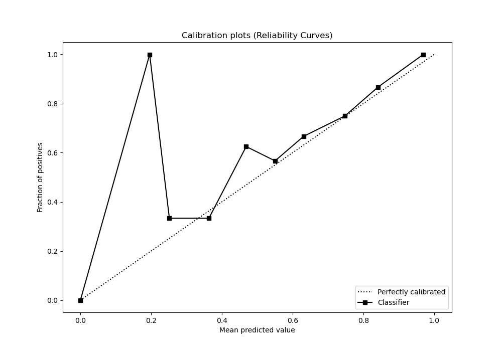
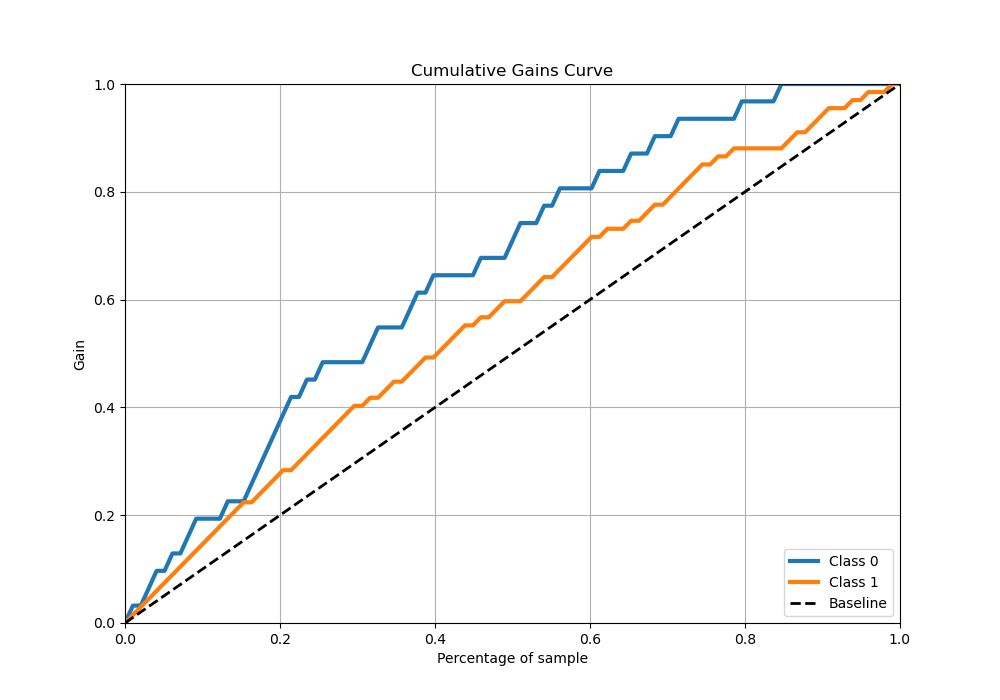
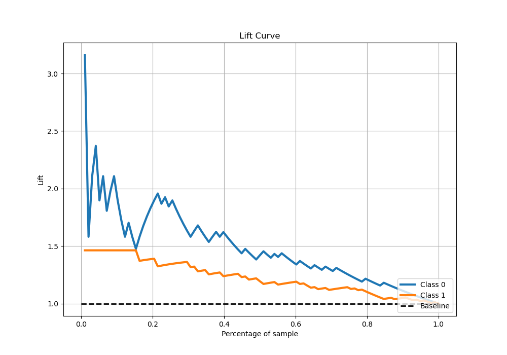

# Summary of 31_CatBoost_GoldenFeatures

[<< Go back](../README.md)

## CatBoost
- **n_jobs**: -1
- **learning_rate**: 0.1
- **depth**: 7
- **rsm**: 1.0
- **loss_function**: Logloss
- **eval_metric**: Logloss
- **explain_level**: 0

## Validation
 - **validation_type**: custom

## Optimized metric
logloss

## Training time

278.9 seconds

## Metric details
|           |    score |    threshold |
|:----------|---------:|-------------:|
| logloss   | 0.545696 | nan          |
| auc       | 0.732065 | nan          |
| f1        | 0.820513 |   0.431243   |
| accuracy  | 0.714286 |   0.431243   |
| precision | 1        |   0.850242   |
| recall    | 1        |   0.00783372 |
| mcc       | 0.343529 |   0.578663   |

## Confusion matrix (at threshold=0.431243)
|              |   Predicted as 0 |   Predicted as 1 |
|:-------------|-----------------:|-----------------:|
| Labeled as 0 |                6 |               25 |
| Labeled as 1 |                3 |               64 |

## Learning curves

## Confusion Matrix

## Normalized Confusion Matrix

## ROC Curve

## Kolmogorov-Smirnov Statistic

## Precision-Recall Curve

## Calibration Curve

## Cumulative Gains Curve

## Lift Curve

[<< Go back](../README.md)
