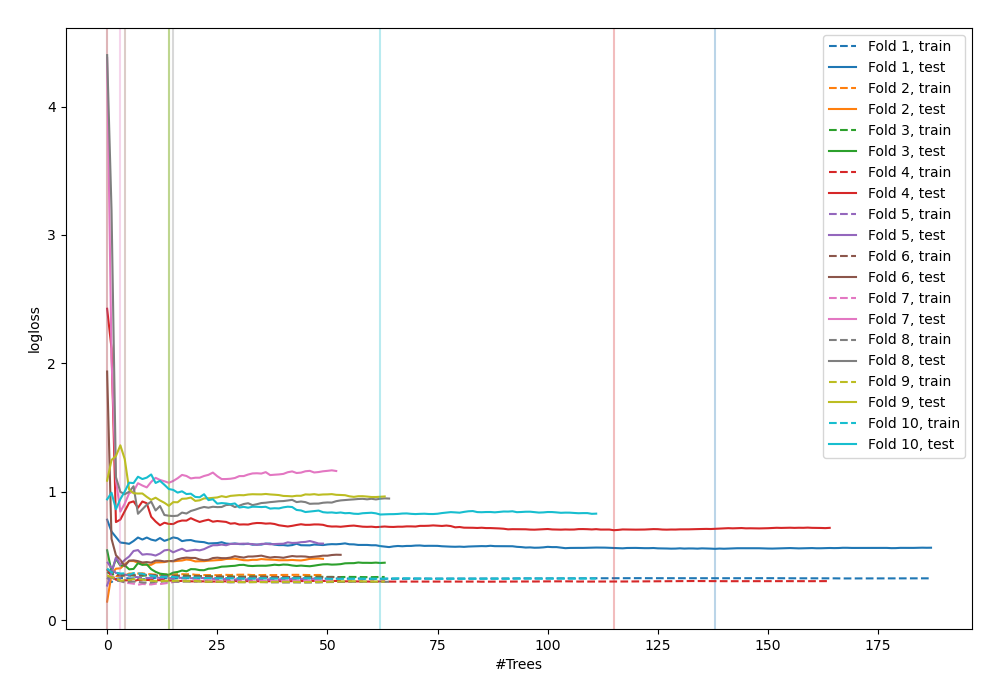

# Summary of 54_ExtraTrees

[<< Go back](../README.md)

## Extra Trees Classifier (Extra Trees)
- **n_jobs**: -1
- **criterion**: entropy
- **max_features**: 0.8
- **min_samples_split**: 30
- **max_depth**: 5
- **eval_metric_name**: logloss
- **explain_level**: 0

## Validation
 - **validation_type**: custom

## Optimized metric
logloss

## Training time

41.4 seconds

## Metric details
|           |    score |   threshold |
|:----------|---------:|------------:|
| logloss   | 0.575354 |  nan        |
| auc       | 0.69066  |  nan        |
| f1        | 0.834437 |    0.429412 |
| accuracy  | 0.744898 |    0.429412 |
| precision | 1        |    0.923883 |
| recall    | 1        |    0        |
| mcc       | 0.363327 |    0.491177 |

## Confusion matrix (at threshold=0.429412)
|              |   Predicted as 0 |   Predicted as 1 |
|:-------------|-----------------:|-----------------:|
| Labeled as 0 |               10 |               21 |
| Labeled as 1 |                4 |               63 |

## Learning curves

## Confusion Matrix

## Normalized Confusion Matrix

## ROC Curve

## Kolmogorov-Smirnov Statistic

## Precision-Recall Curve

## Calibration Curve

## Cumulative Gains Curve

## Lift Curve

[<< Go back](../README.md)
