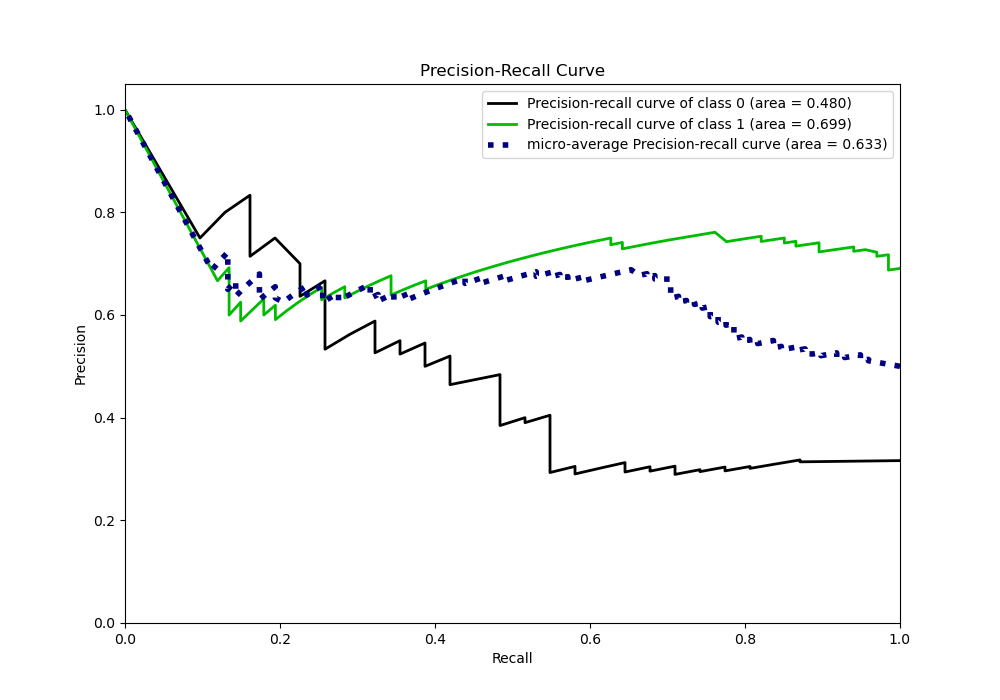

# Summary of 94_NeuralNetwork

[<< Go back](../README.md)

## Neural Network
- **n_jobs**: -1
- **dense_1_size**: 32
- **dense_2_size**: 16
- **learning_rate**: 0.08
- **explain_level**: 0

## Validation
 - **validation_type**: custom

## Optimized metric
logloss

## Training time

35.6 seconds

## Metric details
|           |    score |     threshold |
|:----------|---------:|--------------:|
| logloss   | 3.04552  | nan           |
| auc       | 0.567405 | nan           |
| f1        | 0.828025 |   1.16763e-10 |
| accuracy  | 0.72449  |   7.65691e-09 |
| precision | 0.75     |   0.391877    |
| recall    | 1        |   1.0353e-69  |
| mcc       | 0.278117 |   7.65691e-09 |

## Confusion matrix (at threshold=0.0)
|              |   Predicted as 0 |   Predicted as 1 |
|:-------------|-----------------:|-----------------:|
| Labeled as 0 |                7 |               24 |
| Labeled as 1 |                3 |               64 |

## Learning curves

## Confusion Matrix

## Normalized Confusion Matrix

## ROC Curve

## Kolmogorov-Smirnov Statistic

## Precision-Recall Curve

## Calibration Curve

## Cumulative Gains Curve

## Lift Curve

[<< Go back](../README.md)
