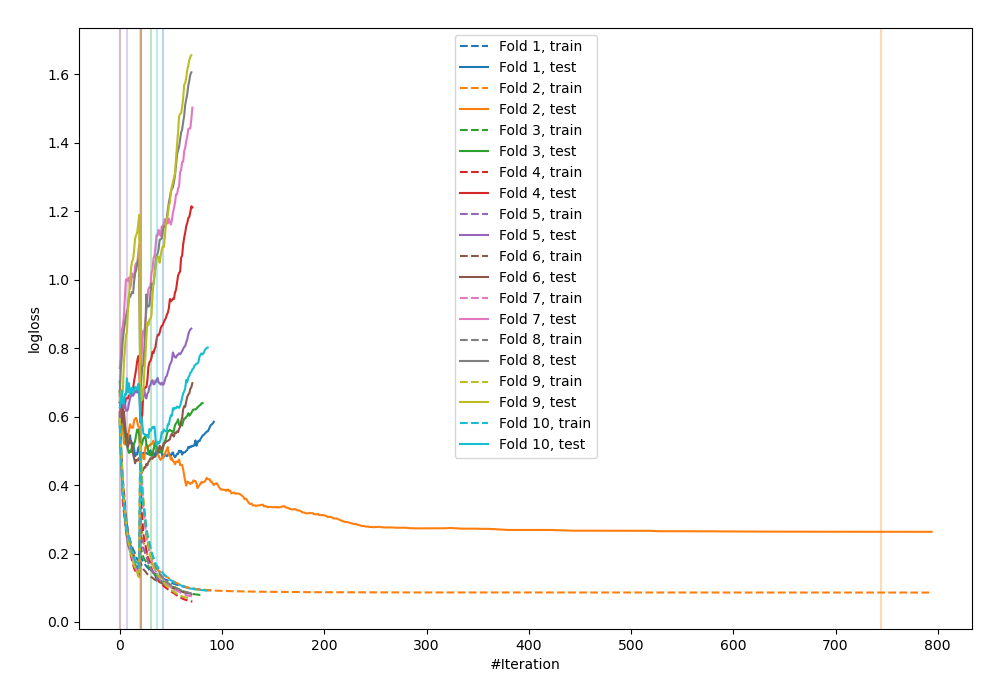
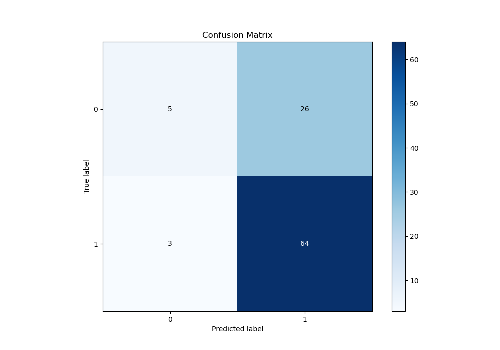
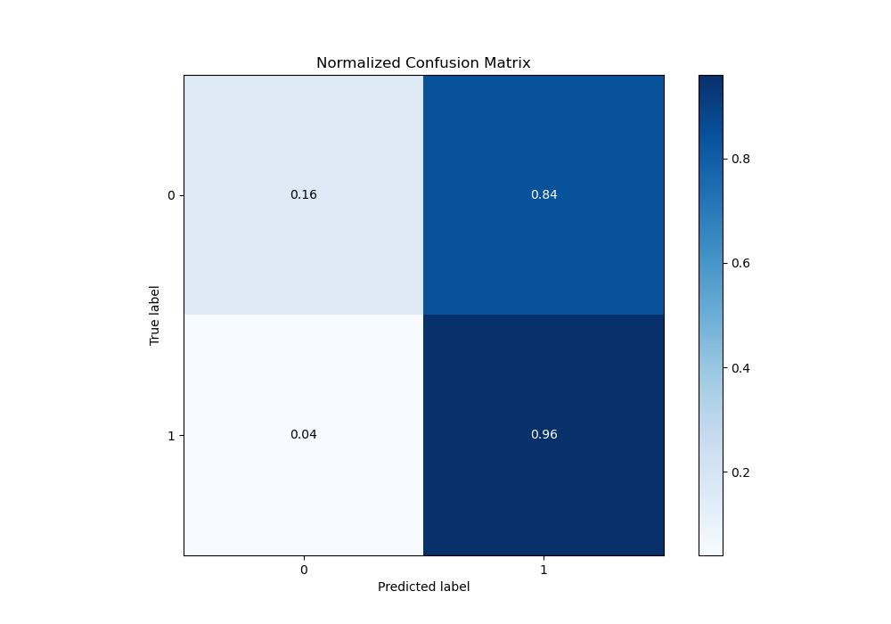
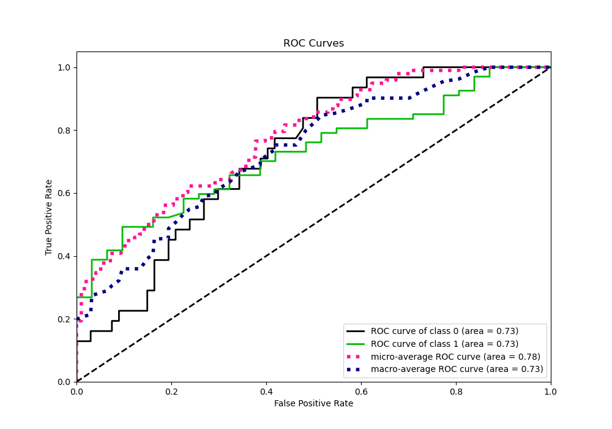
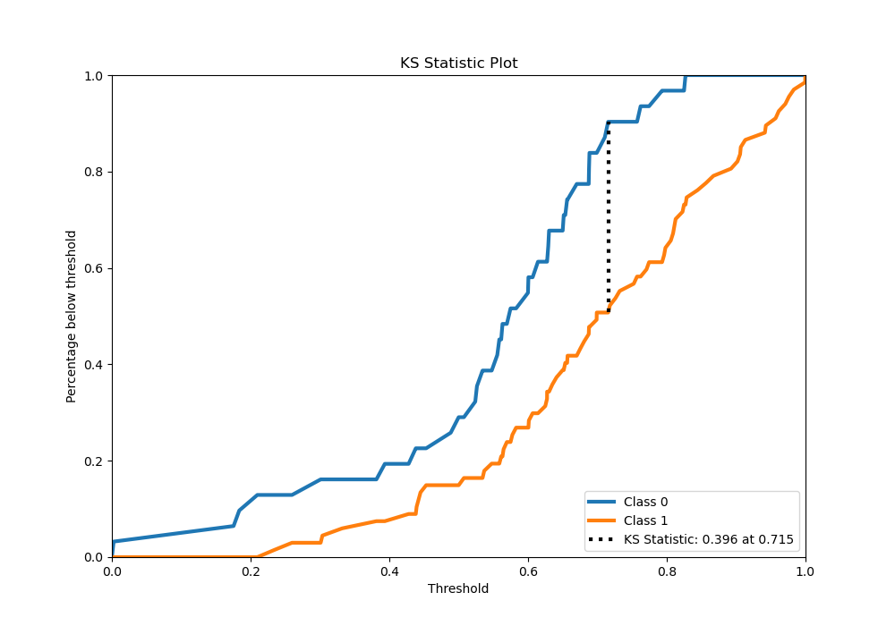
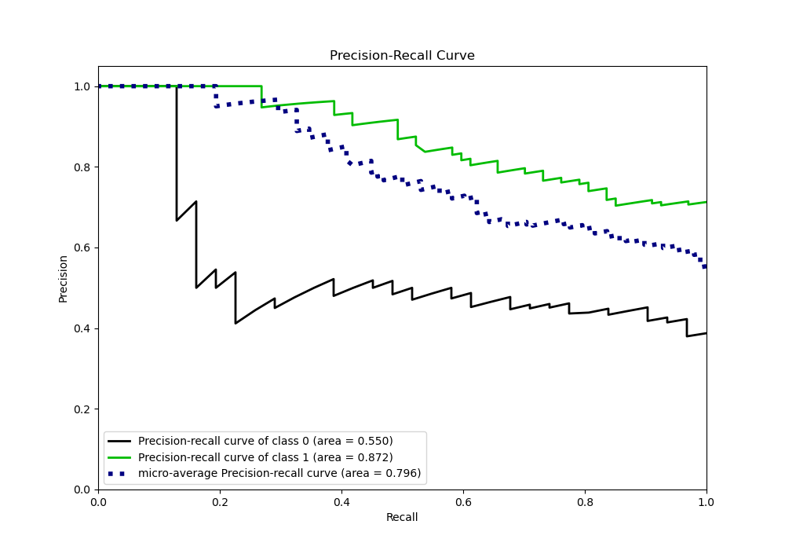
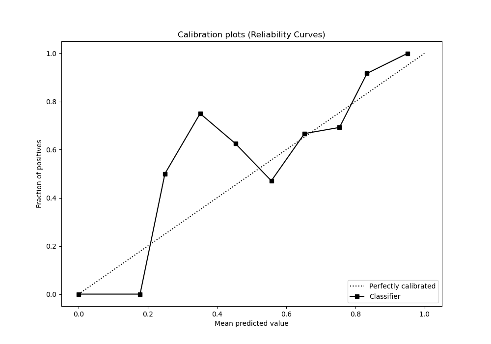
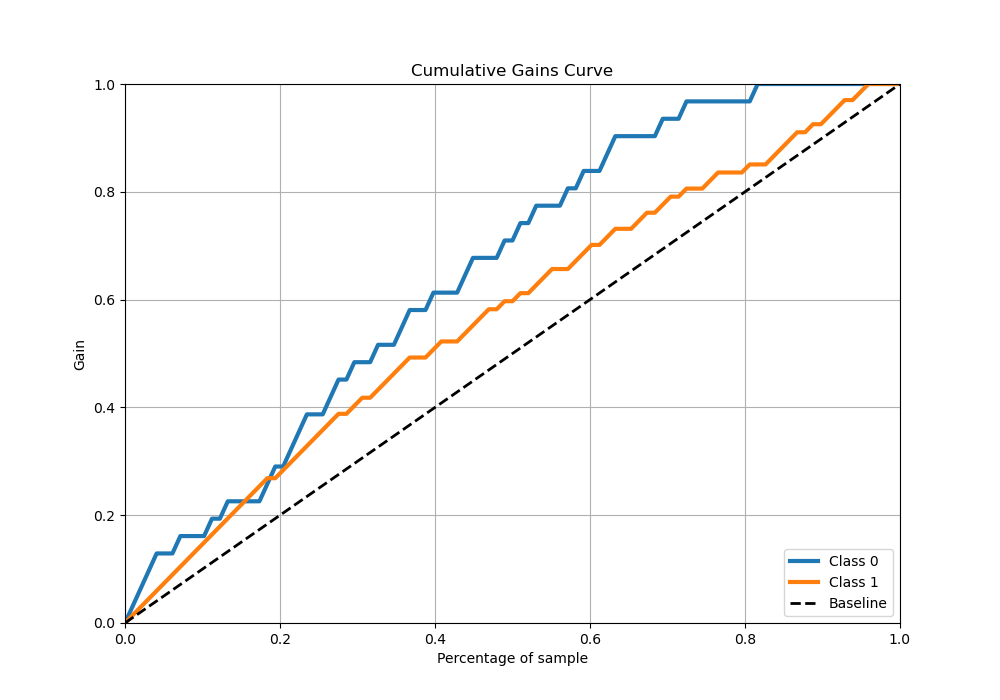
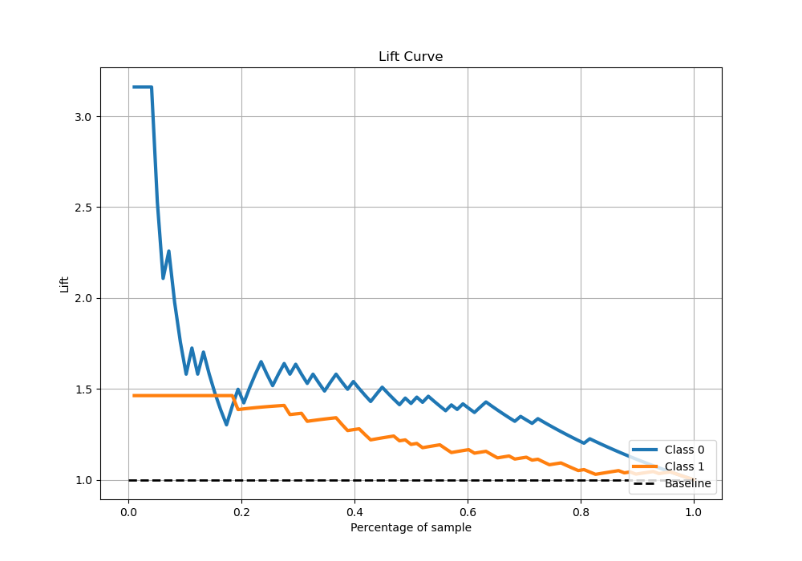

# Summary of 98_CatBoost_GoldenFeatures

[<< Go back](../README.md)

## CatBoost
- **n_jobs**: -1
- **learning_rate**: 0.2
- **depth**: 7
- **rsm**: 1.0
- **loss_function**: Logloss
- **eval_metric**: Logloss
- **explain_level**: 0

## Validation
 - **validation_type**: custom

## Optimized metric
logloss

## Training time

82.7 seconds

## Metric details
|           |    score |    threshold |
|:----------|---------:|-------------:|
| logloss   | 0.545204 | nan          |
| auc       | 0.727732 | nan          |
| f1        | 0.815287 |   0.321811   |
| accuracy  | 0.704082 |   0.321811   |
| precision | 1        |   0.88208    |
| recall    | 1        |   0.00229476 |
| mcc       | 0.370352 |   0.793843   |

## Confusion matrix (at threshold=0.321811)
|              |   Predicted as 0 |   Predicted as 1 |
|:-------------|-----------------:|-----------------:|
| Labeled as 0 |                5 |               26 |
| Labeled as 1 |                3 |               64 |

## Learning curves

## Confusion Matrix

## Normalized Confusion Matrix

## ROC Curve

## Kolmogorov-Smirnov Statistic

## Precision-Recall Curve

## Calibration Curve

## Cumulative Gains Curve

## Lift Curve

[<< Go back](../README.md)
