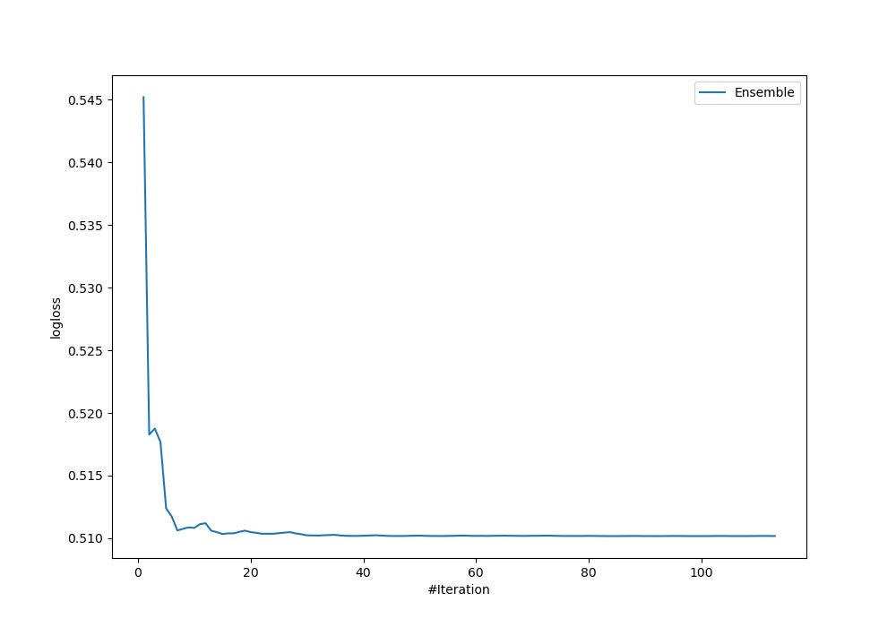
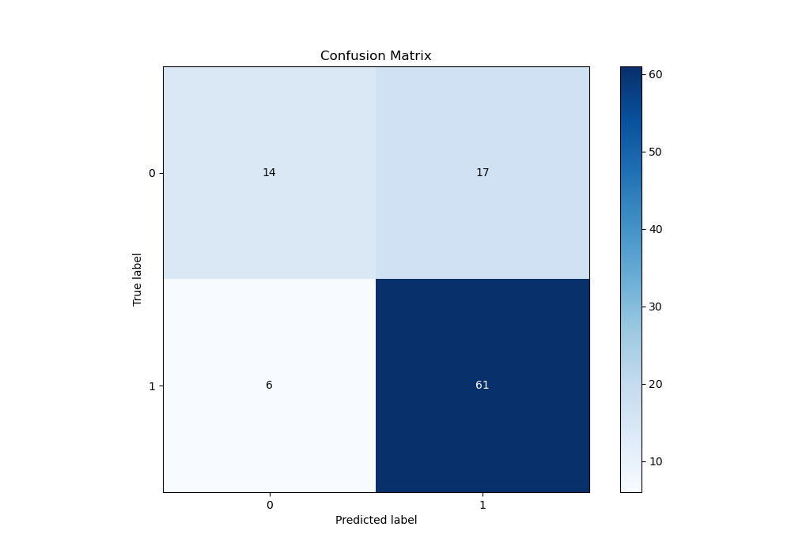
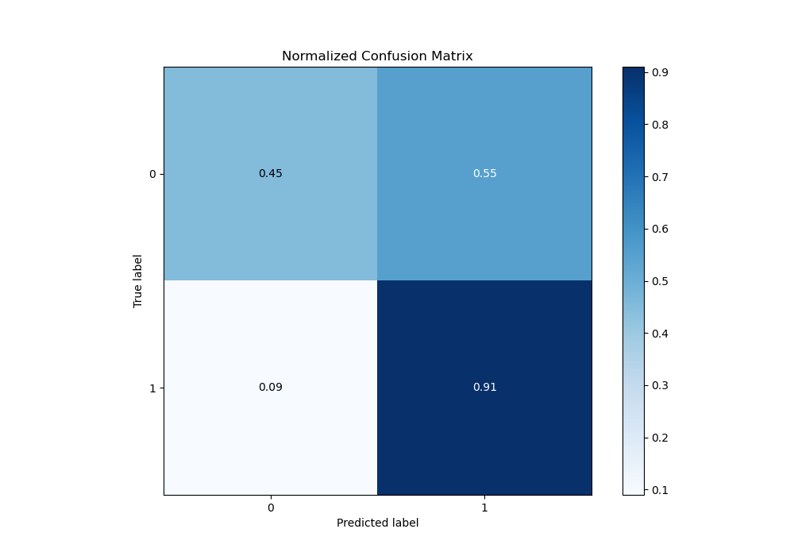
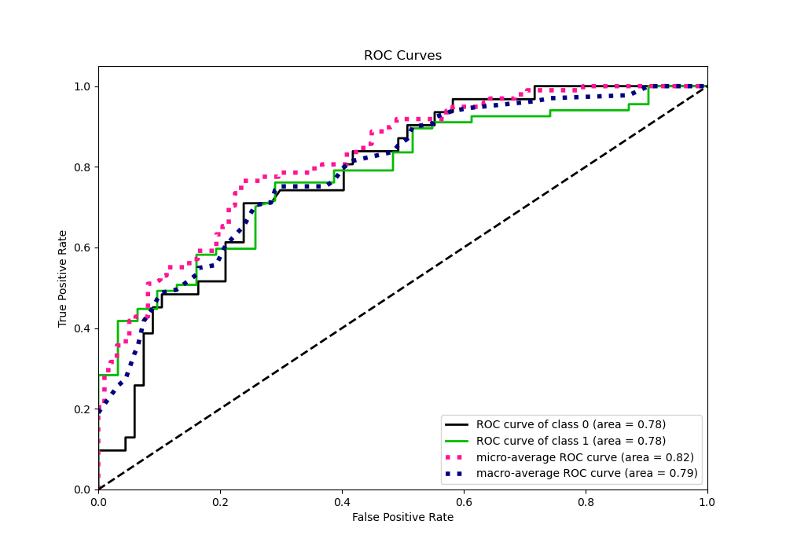
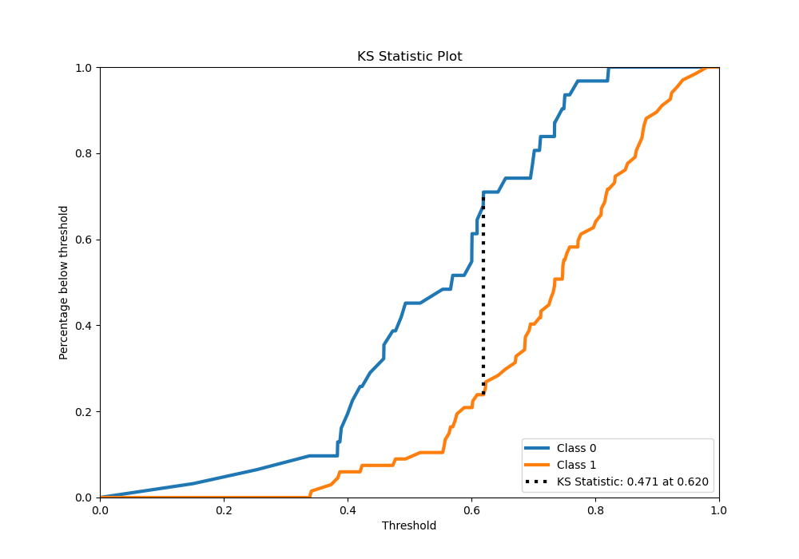
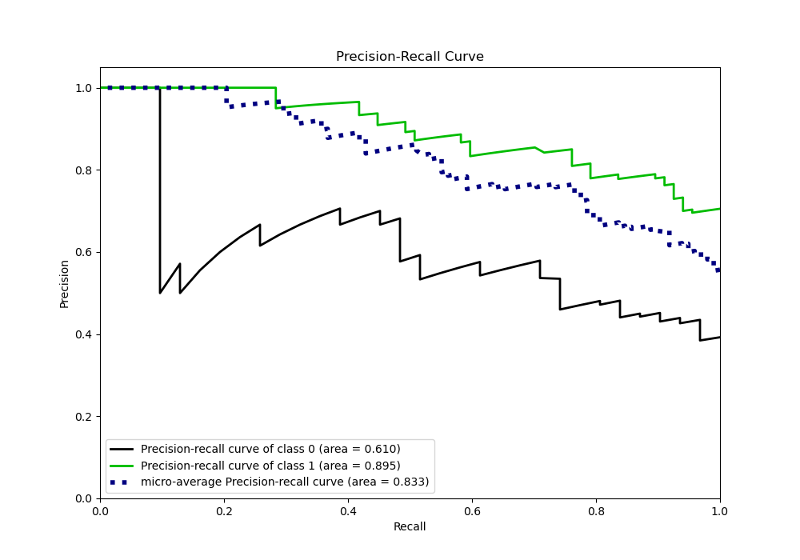
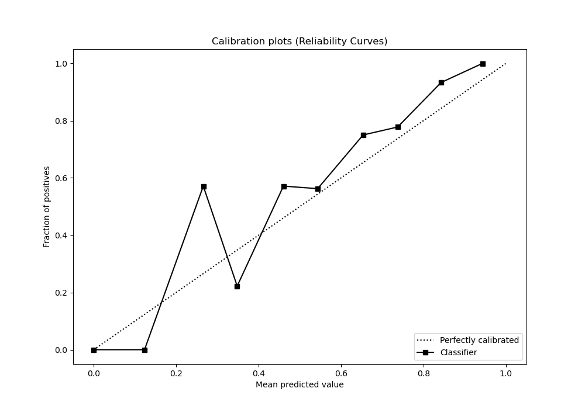
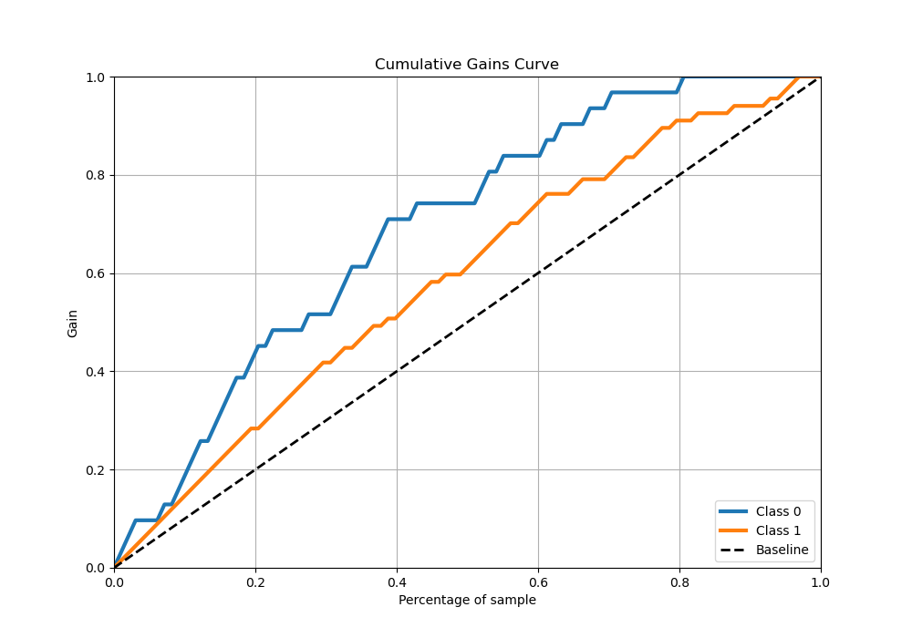
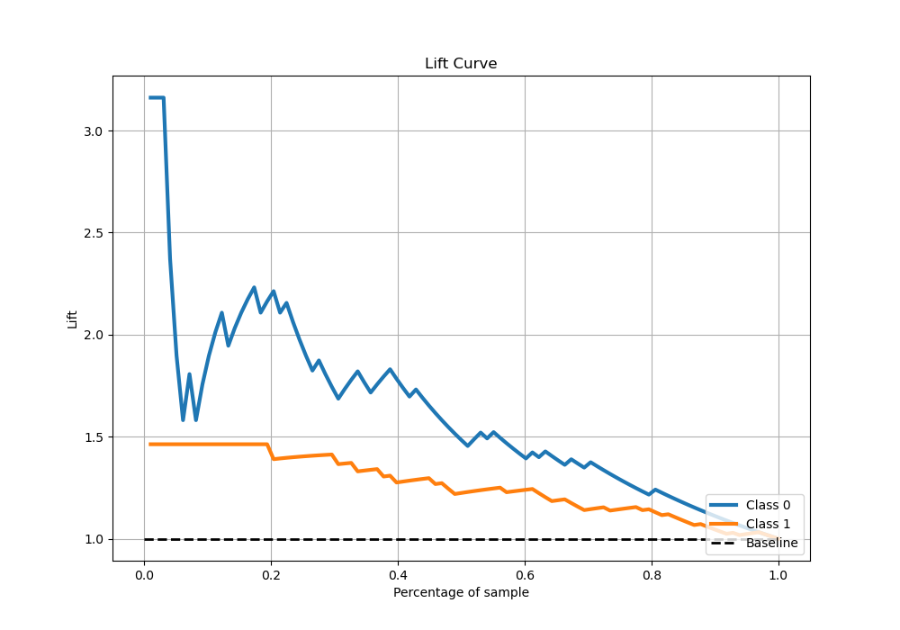

# Summary of Ensemble

[<< Go back](../README.md)

## Ensemble structure
| Model                      |   Weight |
|:---------------------------|---------:|
| 102_CatBoost               |       10 |
| 106_RandomForest           |       38 |
| 31_CatBoost_GoldenFeatures |        4 |
| 54_ExtraTrees              |        5 |
| 62_NeuralNetwork           |        2 |
| 94_NeuralNetwork           |       12 |
| 98_CatBoost_GoldenFeatures |       21 |

## Metric details
|           |    score |   threshold |
|:----------|---------:|------------:|
| logloss   | 0.510172 |  nan        |
| auc       | 0.782619 |  nan        |
| f1        | 0.841379 |    0.508194 |
| accuracy  | 0.765306 |    0.508194 |
| precision | 1        |    0.827978 |
| recall    | 1        |    0.13551  |
| mcc       | 0.449421 |    0.620594 |

## Confusion matrix (at threshold=0.508194)
|              |   Predicted as 0 |   Predicted as 1 |
|:-------------|-----------------:|-----------------:|
| Labeled as 0 |               14 |               17 |
| Labeled as 1 |                6 |               61 |

## Learning curves

## Confusion Matrix

## Normalized Confusion Matrix

## ROC Curve

## Kolmogorov-Smirnov Statistic

## Precision-Recall Curve

## Calibration Curve

## Cumulative Gains Curve

## Lift Curve

[<< Go back](../README.md)
