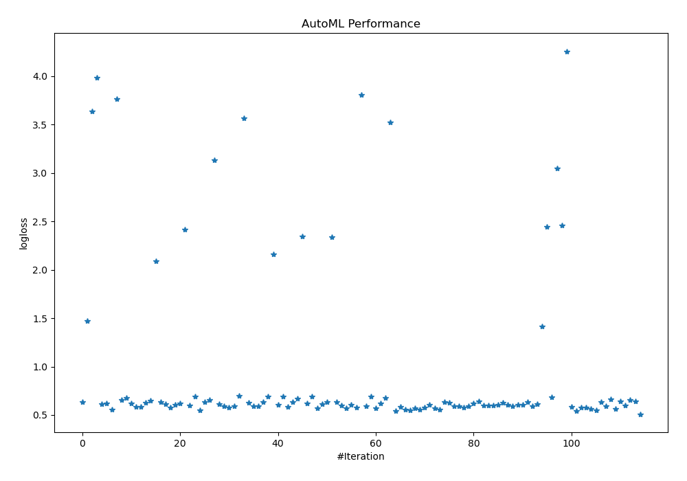
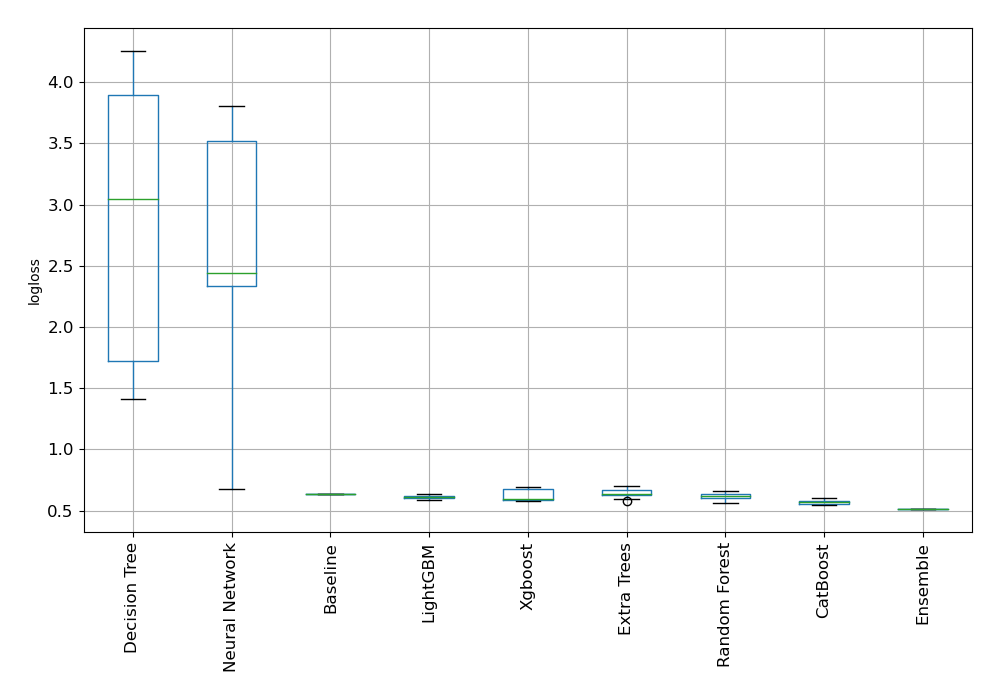
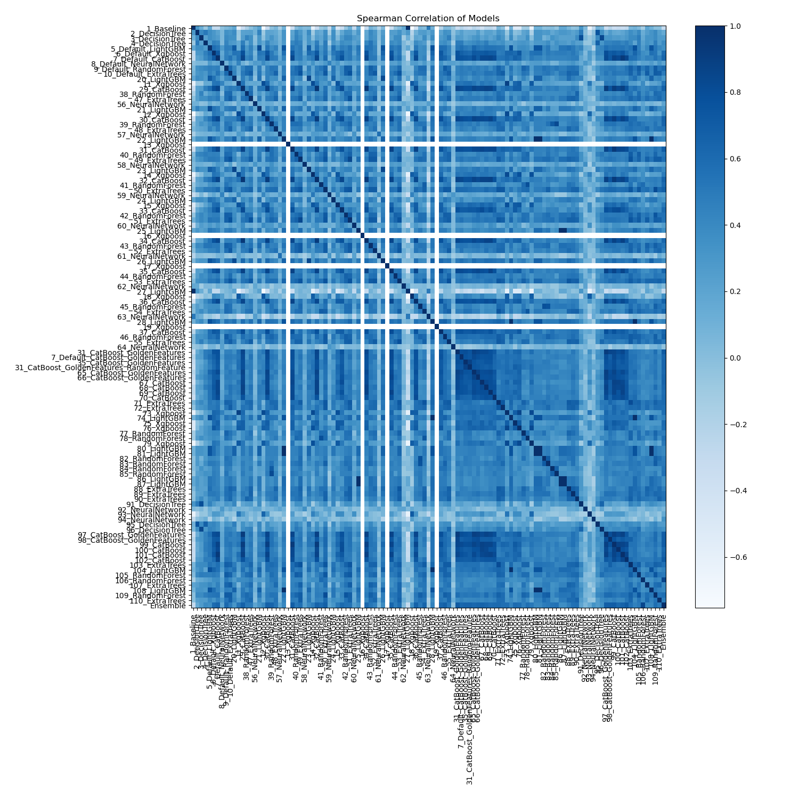

# AutoML Leaderboard

| Best model   | name                                                                                           | model_type     | metric_type   |   metric_value |   train_time |
|:-------------|:-----------------------------------------------------------------------------------------------|:---------------|:--------------|---------------:|-------------:|
|              | [1_Baseline](1_Baseline/README.md)                                                             | Baseline       | logloss       |       0.637798 |         8.17 |
|              | [2_DecisionTree](2_DecisionTree/README.md)                                                     | Decision Tree  | logloss       |       1.47282  |         8.74 |
|              | [3_DecisionTree](3_DecisionTree/README.md)                                                     | Decision Tree  | logloss       |       3.63894  |         8.72 |
|              | [4_DecisionTree](4_DecisionTree/README.md)                                                     | Decision Tree  | logloss       |       3.98686  |         8.64 |
|              | [5_Default_LightGBM](5_Default_LightGBM/README.md)                                             | LightGBM       | logloss       |       0.613137 |        10.85 |
|              | [6_Default_Xgboost](6_Default_Xgboost/README.md)                                               | Xgboost        | logloss       |       0.619177 |        13.87 |
|              | [7_Default_CatBoost](7_Default_CatBoost/README.md)                                             | CatBoost       | logloss       |       0.55572  |        36.59 |
|              | [8_Default_NeuralNetwork](8_Default_NeuralNetwork/README.md)                                   | Neural Network | logloss       |       3.7653   |        22.58 |
|              | [9_Default_RandomForest](9_Default_RandomForest/README.md)                                     | Random Forest  | logloss       |       0.654054 |        41.66 |
|              | [10_Default_ExtraTrees](10_Default_ExtraTrees/README.md)                                       | Extra Trees    | logloss       |       0.680709 |        33.33 |
|              | [20_LightGBM](20_LightGBM/README.md)                                                           | LightGBM       | logloss       |       0.619785 |        11.83 |
|              | [11_Xgboost](11_Xgboost/README.md)                                                             | Xgboost        | logloss       |       0.588349 |        11.92 |
|              | [29_CatBoost](29_CatBoost/README.md)                                                           | CatBoost       | logloss       |       0.584516 |        76.46 |
|              | [38_RandomForest](38_RandomForest/README.md)                                                   | Random Forest  | logloss       |       0.627122 |        37.27 |
|              | [47_ExtraTrees](47_ExtraTrees/README.md)                                                       | Extra Trees    | logloss       |       0.647047 |        30.45 |
|              | [56_NeuralNetwork](56_NeuralNetwork/README.md)                                                 | Neural Network | logloss       |       2.08938  |        25.79 |
|              | [21_LightGBM](21_LightGBM/README.md)                                                           | LightGBM       | logloss       |       0.635377 |        12.7  |
|              | [12_Xgboost](12_Xgboost/README.md)                                                             | Xgboost        | logloss       |       0.615231 |        13.56 |
|              | [30_CatBoost](30_CatBoost/README.md)                                                           | CatBoost       | logloss       |       0.578547 |        34.63 |
|              | [39_RandomForest](39_RandomForest/README.md)                                                   | Random Forest  | logloss       |       0.607032 |        32.62 |
|              | [48_ExtraTrees](48_ExtraTrees/README.md)                                                       | Extra Trees    | logloss       |       0.618779 |        31.95 |
|              | [57_NeuralNetwork](57_NeuralNetwork/README.md)                                                 | Neural Network | logloss       |       2.41919  |        24.8  |
|              | [22_LightGBM](22_LightGBM/README.md)                                                           | LightGBM       | logloss       |       0.600279 |        13.89 |
|              | [13_Xgboost](13_Xgboost/README.md)                                                             | Xgboost        | logloss       |       0.693147 |        12.89 |
|              | [31_CatBoost](31_CatBoost/README.md)                                                           | CatBoost       | logloss       |       0.550774 |        48.73 |
|              | [40_RandomForest](40_RandomForest/README.md)                                                   | Random Forest  | logloss       |       0.636576 |        35.87 |
|              | [49_ExtraTrees](49_ExtraTrees/README.md)                                                       | Extra Trees    | logloss       |       0.653382 |        32.99 |
|              | [58_NeuralNetwork](58_NeuralNetwork/README.md)                                                 | Neural Network | logloss       |       3.13064  |        27.2  |
|              | [23_LightGBM](23_LightGBM/README.md)                                                           | LightGBM       | logloss       |       0.610505 |        27.14 |
|              | [14_Xgboost](14_Xgboost/README.md)                                                             | Xgboost        | logloss       |       0.594245 |        16.66 |
|              | [32_CatBoost](32_CatBoost/README.md)                                                           | CatBoost       | logloss       |       0.5759   |        67.63 |
|              | [41_RandomForest](41_RandomForest/README.md)                                                   | Random Forest  | logloss       |       0.593399 |        36.03 |
|              | [50_ExtraTrees](50_ExtraTrees/README.md)                                                       | Extra Trees    | logloss       |       0.701034 |        34.37 |
|              | [59_NeuralNetwork](59_NeuralNetwork/README.md)                                                 | Neural Network | logloss       |       3.56847  |        27.83 |
|              | [24_LightGBM](24_LightGBM/README.md)                                                           | LightGBM       | logloss       |       0.626665 |        16.71 |
|              | [15_Xgboost](15_Xgboost/README.md)                                                             | Xgboost        | logloss       |       0.590655 |        17.7  |
|              | [33_CatBoost](33_CatBoost/README.md)                                                           | CatBoost       | logloss       |       0.594306 |        45.39 |
|              | [42_RandomForest](42_RandomForest/README.md)                                                   | Random Forest  | logloss       |       0.636853 |        47.06 |
|              | [51_ExtraTrees](51_ExtraTrees/README.md)                                                       | Extra Trees    | logloss       |       0.693944 |        38.32 |
|              | [60_NeuralNetwork](60_NeuralNetwork/README.md)                                                 | Neural Network | logloss       |       2.1636   |        29.24 |
|              | [25_LightGBM](25_LightGBM/README.md)                                                           | LightGBM       | logloss       |       0.608567 |        17.18 |
|              | [16_Xgboost](16_Xgboost/README.md)                                                             | Xgboost        | logloss       |       0.693147 |        17.38 |
|              | [34_CatBoost](34_CatBoost/README.md)                                                           | CatBoost       | logloss       |       0.584464 |       115.73 |
|              | [43_RandomForest](43_RandomForest/README.md)                                                   | Random Forest  | logloss       |       0.633953 |        38.5  |
|              | [52_ExtraTrees](52_ExtraTrees/README.md)                                                       | Extra Trees    | logloss       |       0.670379 |        36.1  |
|              | [61_NeuralNetwork](61_NeuralNetwork/README.md)                                                 | Neural Network | logloss       |       2.34689  |        32.07 |
|              | [26_LightGBM](26_LightGBM/README.md)                                                           | LightGBM       | logloss       |       0.619252 |        18.42 |
|              | [17_Xgboost](17_Xgboost/README.md)                                                             | Xgboost        | logloss       |       0.693147 |        17.59 |
|              | [35_CatBoost](35_CatBoost/README.md)                                                           | CatBoost       | logloss       |       0.571906 |        56.23 |
|              | [44_RandomForest](44_RandomForest/README.md)                                                   | Random Forest  | logloss       |       0.616569 |        45.69 |
|              | [53_ExtraTrees](53_ExtraTrees/README.md)                                                       | Extra Trees    | logloss       |       0.636088 |        34.64 |
|              | [62_NeuralNetwork](62_NeuralNetwork/README.md)                                                 | Neural Network | logloss       |       2.33643  |        32.33 |
|              | [27_LightGBM](27_LightGBM/README.md)                                                           | LightGBM       | logloss       |       0.637798 |        19.18 |
|              | [18_Xgboost](18_Xgboost/README.md)                                                             | Xgboost        | logloss       |       0.60271  |        20.27 |
|              | [36_CatBoost](36_CatBoost/README.md)                                                           | CatBoost       | logloss       |       0.572384 |        44.56 |
|              | [45_RandomForest](45_RandomForest/README.md)                                                   | Random Forest  | logloss       |       0.605281 |        36.63 |
|              | [54_ExtraTrees](54_ExtraTrees/README.md)                                                       | Extra Trees    | logloss       |       0.575354 |        42.78 |
|              | [63_NeuralNetwork](63_NeuralNetwork/README.md)                                                 | Neural Network | logloss       |       3.80369  |        33.53 |
|              | [28_LightGBM](28_LightGBM/README.md)                                                           | LightGBM       | logloss       |       0.58965  |        21.17 |
|              | [19_Xgboost](19_Xgboost/README.md)                                                             | Xgboost        | logloss       |       0.693147 |        19.56 |
|              | [37_CatBoost](37_CatBoost/README.md)                                                           | CatBoost       | logloss       |       0.572568 |        36.38 |
|              | [46_RandomForest](46_RandomForest/README.md)                                                   | Random Forest  | logloss       |       0.622082 |        45.88 |
|              | [55_ExtraTrees](55_ExtraTrees/README.md)                                                       | Extra Trees    | logloss       |       0.674144 |        42.16 |
|              | [64_NeuralNetwork](64_NeuralNetwork/README.md)                                                 | Neural Network | logloss       |       3.52418  |        34.58 |
|              | [31_CatBoost_GoldenFeatures](31_CatBoost_GoldenFeatures/README.md)                             | CatBoost       | logloss       |       0.545696 |       280.22 |
|              | [7_Default_CatBoost_GoldenFeatures](7_Default_CatBoost_GoldenFeatures/README.md)               | CatBoost       | logloss       |       0.583439 |        50.25 |
|              | [35_CatBoost_GoldenFeatures](35_CatBoost_GoldenFeatures/README.md)                             | CatBoost       | logloss       |       0.557787 |       110.88 |
|              | [31_CatBoost_GoldenFeatures_RandomFeature](31_CatBoost_GoldenFeatures_RandomFeature/README.md) | CatBoost       | logloss       |       0.548138 |      1087.3  |
|              | [65_CatBoost_GoldenFeatures](65_CatBoost_GoldenFeatures/README.md)                             | CatBoost       | logloss       |       0.570135 |        51.08 |
|              | [66_CatBoost_GoldenFeatures](66_CatBoost_GoldenFeatures/README.md)                             | CatBoost       | logloss       |       0.558173 |        74.79 |
|              | [67_CatBoost](67_CatBoost/README.md)                                                           | CatBoost       | logloss       |       0.575741 |        48.22 |
|              | [68_CatBoost](68_CatBoost/README.md)                                                           | CatBoost       | logloss       |       0.602974 |        66.7  |
|              | [69_CatBoost](69_CatBoost/README.md)                                                           | CatBoost       | logloss       |       0.56939  |        43.82 |
|              | [70_CatBoost](70_CatBoost/README.md)                                                           | CatBoost       | logloss       |       0.559278 |        59.69 |
|              | [71_ExtraTrees](71_ExtraTrees/README.md)                                                       | Extra Trees    | logloss       |       0.635918 |        40.06 |
|              | [72_ExtraTrees](72_ExtraTrees/README.md)                                                       | Extra Trees    | logloss       |       0.6297   |        38.14 |
|              | [73_Xgboost](73_Xgboost/README.md)                                                             | Xgboost        | logloss       |       0.591696 |        26.01 |
|              | [74_LightGBM](74_LightGBM/README.md)                                                           | LightGBM       | logloss       |       0.58965  |        24.51 |
|              | [75_Xgboost](75_Xgboost/README.md)                                                             | Xgboost        | logloss       |       0.579742 |        30.41 |
|              | [76_Xgboost](76_Xgboost/README.md)                                                             | Xgboost        | logloss       |       0.591109 |        25.63 |
|              | [77_RandomForest](77_RandomForest/README.md)                                                   | Random Forest  | logloss       |       0.62234  |        41.92 |
|              | [78_RandomForest](78_RandomForest/README.md)                                                   | Random Forest  | logloss       |       0.642797 |        47.32 |
|              | [79_Xgboost](79_Xgboost/README.md)                                                             | Xgboost        | logloss       |       0.595777 |        23.95 |
|              | [80_LightGBM](80_LightGBM/README.md)                                                           | LightGBM       | logloss       |       0.600279 |        24.34 |
|              | [81_LightGBM](81_LightGBM/README.md)                                                           | LightGBM       | logloss       |       0.600279 |        25.16 |
|              | [82_RandomForest](82_RandomForest/README.md)                                                   | Random Forest  | logloss       |       0.605007 |        41.69 |
|              | [83_RandomForest](83_RandomForest/README.md)                                                   | Random Forest  | logloss       |       0.626719 |        44.51 |
|              | [84_RandomForest](84_RandomForest/README.md)                                                   | Random Forest  | logloss       |       0.609038 |        44.61 |
|              | [85_RandomForest](85_RandomForest/README.md)                                                   | Random Forest  | logloss       |       0.589735 |        43.74 |
|              | [86_LightGBM](86_LightGBM/README.md)                                                           | LightGBM       | logloss       |       0.608567 |        27.52 |
|              | [87_LightGBM](87_LightGBM/README.md)                                                           | LightGBM       | logloss       |       0.608567 |        25.87 |
|              | [88_ExtraTrees](88_ExtraTrees/README.md)                                                       | Extra Trees    | logloss       |       0.636021 |        40.93 |
|              | [89_ExtraTrees](89_ExtraTrees/README.md)                                                       | Extra Trees    | logloss       |       0.59392  |        46.89 |
|              | [90_ExtraTrees](90_ExtraTrees/README.md)                                                       | Extra Trees    | logloss       |       0.61135  |        42.9  |
|              | [91_DecisionTree](91_DecisionTree/README.md)                                                   | Decision Tree  | logloss       |       1.41541  |        27.15 |
|              | [92_NeuralNetwork](92_NeuralNetwork/README.md)                                                 | Neural Network | logloss       |       2.44518  |        41.1  |
|              | [93_NeuralNetwork](93_NeuralNetwork/README.md)                                                 | Neural Network | logloss       |       0.68109  |        38.02 |
|              | [94_NeuralNetwork](94_NeuralNetwork/README.md)                                                 | Neural Network | logloss       |       3.04552  |        36.89 |
|              | [95_DecisionTree](95_DecisionTree/README.md)                                                   | Decision Tree  | logloss       |       2.46176  |        22.17 |
|              | [96_DecisionTree](96_DecisionTree/README.md)                                                   | Decision Tree  | logloss       |       4.2577   |        21.8  |
|              | [97_CatBoost_GoldenFeatures](97_CatBoost_GoldenFeatures/README.md)                             | CatBoost       | logloss       |       0.585699 |        69.37 |
|              | [98_CatBoost_GoldenFeatures](98_CatBoost_GoldenFeatures/README.md)                             | CatBoost       | logloss       |       0.545204 |        84.16 |
|              | [99_CatBoost](99_CatBoost/README.md)                                                           | CatBoost       | logloss       |       0.575976 |        66.75 |
|              | [100_CatBoost](100_CatBoost/README.md)                                                         | CatBoost       | logloss       |       0.579782 |        58.8  |
|              | [101_CatBoost](101_CatBoost/README.md)                                                         | CatBoost       | logloss       |       0.566259 |        56.78 |
|              | [102_CatBoost](102_CatBoost/README.md)                                                         | CatBoost       | logloss       |       0.546841 |        52.04 |
|              | [103_ExtraTrees](103_ExtraTrees/README.md)                                                     | Extra Trees    | logloss       |       0.633604 |        46.57 |
|              | [104_LightGBM](104_LightGBM/README.md)                                                         | LightGBM       | logloss       |       0.58965  |        27.8  |
|              | [105_RandomForest](105_RandomForest/README.md)                                                 | Random Forest  | logloss       |       0.661498 |        50.68 |
|              | [106_RandomForest](106_RandomForest/README.md)                                                 | Random Forest  | logloss       |       0.560881 |        50.48 |
|              | [107_ExtraTrees](107_ExtraTrees/README.md)                                                     | Extra Trees    | logloss       |       0.644348 |        45.76 |
|              | [108_LightGBM](108_LightGBM/README.md)                                                         | LightGBM       | logloss       |       0.600279 |        28.05 |
|              | [109_RandomForest](109_RandomForest/README.md)                                                 | Random Forest  | logloss       |       0.65338  |        48.36 |
|              | [110_ExtraTrees](110_ExtraTrees/README.md)                                                     | Extra Trees    | logloss       |       0.641075 |        47.43 |
| **the best** | [Ensemble](Ensemble/README.md)                                                                 | Ensemble       | logloss       |       0.510172 |        63.69 |

### AutoML Performance

### AutoML Performance Boxplot

### Spearman Correlation of Models

